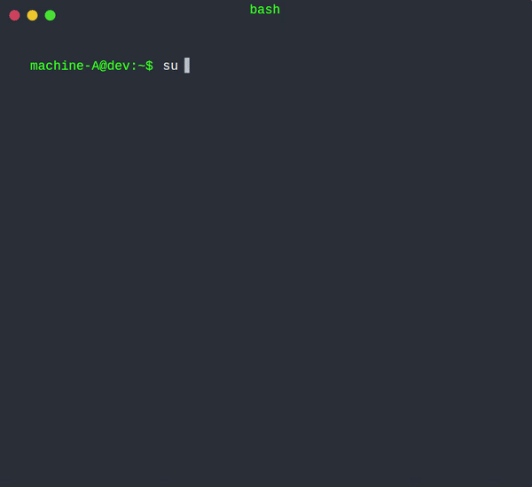

<p align="center">
 <strong>Big News! Wiretrustee becomes Netbird</strong>.
  <a href="https://netbird.io/blog/wiretrustee-becomes-netbird">
       Learn more
     </a>   
</p>

<br/>
<div align="center">

<p align="center">
  
</p>

  <p>
     <a href="https://github.com/netbirdio/netbird/blob/main/LICENSE">
       
     </a> 
     <a href="https://hub.docker.com/r/wiretrustee/wiretrustee/tags">
        
     </a>  
    
    <br>
    <a href="https://www.codacy.com/gh/wiretrustee/wiretrustee/dashboard?utm_source=github.com&amp;utm_medium=referral&amp;utm_content=wiretrustee/wiretrustee&amp;utm_campaign=Badge_Grade"></a>
     <a href="https://goreportcard.com/report/wiretrustee/wiretrustee">
        
     </a>
    <br>
    <a href="https://join.slack.com/t/wiretrustee/shared_invite/zt-vrahf41g-ik1v7fV8du6t0RwxSrJ96A">
        
     </a>    
  </p>
</div>


<p align="center">
<strong>
  Start using Netbird at <a href="https://app.netbird.io/">app.netbird.io</a>
  <br/>
  See <a href="https://netbird.io/docs/">Documentation</a>
  <br/>
   Join our <a href="https://join.slack.com/t/wiretrustee/shared_invite/zt-vrahf41g-ik1v7fV8du6t0RwxSrJ96A">Slack channel</a>
  <br/>
 
</strong>
</p>

<br>

**Netbird is an open-source VPN platform built on top of WireGuard® making it easy to create secure private networks for your organization or home.**

It requires zero configuration effort leaving behind the hassle of opening ports, complex firewall rules, VPN gateways, and so forth.

**Netbird automates Wireguard-based networks, offering a management layer with:**
* Centralized Peer IP management with a UI dashboard.
* Encrypted peer-to-peer connections without a centralized VPN gateway.
* Automatic Peer discovery and configuration.
* UDP hole punching to establish peer-to-peer connections behind NAT, firewall, and without a public static IP.
* Connection relay fallback in case a peer-to-peer connection is not possible.
* Multitenancy (coming soon).
* Client application SSO with MFA (coming soon).
* Access Controls (coming soon).
* Activity Monitoring (coming soon).
* Private DNS (coming soon)

### Secure peer-to-peer VPN in minutes
<p float="left" align="middle">
   
  
</p>

**Note**: The `main` branch may be in an *unstable or even broken state* during development. For stable versions, see [releases](https://github.com/netbirdio/netbird).

Hosted version: 
[https://app.netbird.io/](https://app.netbird.io/). 

[UI Dashboard Repo](https://github.com/netbirdio/dashboard)


### A bit on Netbird internals
* Netbird features a Management Service that offers peer IP management and network updates distribution (e.g. when a new peer joins the network).
* Netbird uses WebRTC ICE implemented in [pion/ice library](https://github.com/pion/ice) to discover connection candidates when establishing a peer-to-peer connection between devices.
* Peers negotiate connection through [Signal Service](signal/).
* Signal Service uses public Wireguard keys to route messages between peers.
  Contents of the messages sent between peers through the signaling server are encrypted with Wireguard keys, making it impossible to inspect them.
* Occasionally, the NAT traversal is unsuccessful due to strict NATs (e.g. mobile carrier-grade NAT). When this occurs the system falls back to the relay server (TURN), and a secure Wireguard tunnel is established via the TURN server. [Coturn](https://github.com/coturn/coturn) is the one that has been successfully used for STUN and TURN in Netbird setups.

<p float="left" align="middle">
  
</p>


### Product Roadmap
- [Public Roadmap](https://github.com/netbirdio/netbird/projects/2)
- [Public Roadmap Progress Tracking](https://github.com/netbirdio/netbird/projects/1)

### Client Installation
#### Linux

**APT/Debian**
1. Add the repository:
    ```shell
    sudo apt-get update
    sudo apt-get install ca-certificates curl gnupg -y
    curl -L https://pkgs.wiretrustee.com/debian/public.key | sudo apt-key add -
    echo 'deb https://pkgs.wiretrustee.com/debian stable main' | sudo tee /etc/apt/sources.list.d/wiretrustee.list
    ```
2. Update APT's cache
    ```shell
    sudo apt-get update
    ```
3. Install the package
    ```shell
    # for CLI only
    sudo apt-get install netbird
    # for GUI package
    sudo apt-get install netbird-ui
    ```   
**RPM/Red hat**
1. Add the repository:
    ```shell
    cat <<EOF | sudo tee /etc/yum.repos.d/wiretrustee.repo
    [Wiretrustee]
    name=Wiretrustee
    baseurl=https://pkgs.wiretrustee.com/yum/
    enabled=1
    gpgcheck=0
    gpgkey=https://pkgs.wiretrustee.com/yum/repodata/repomd.xml.key
    repo_gpgcheck=1
    EOF
    ```
2. Install the package
    ```shell
    # for CLI only
    sudo yum install netbird
    # for GUI package
    sudo yum install netbird-ui
    ```
#### MACOS
**Brew install**
1. Download and install Brew at https://brew.sh/
2. Install the client
  ```shell
  # for CLI only
  brew install netbirdio/tap/netbird
  # for GUI package
  brew install --cask netbirdio/tap/netbird-ui
  ```
**Installation from binary (CLI only)**
1. Checkout Netbird [releases](https://github.com/netbirdio/netbird/releases/latest)
2. Download the latest release (**Switch VERSION to the latest**):
  ```shell
  curl -o ./netbird_<VERSION>_darwin_amd64.tar.gz https://github.com/netbirdio/netbird/releases/download/v<VERSION>/wiretrustee_<VERSION>_darwin_amd64.tar.gz
  ```
3. Decompress
  ```shell
  tar xcf ./netbird_<VERSION>_darwin_amd64.tar.gz
  sudo mv netbird /usr/bin/netbird
  chmod +x /usr/bin/netbird
  ```
  After that you may need to add /usr/bin in your PATH environment variable:
  ````shell
  export PATH=$PATH:/usr/bin
  ````
4. Install and run the service
  ```shell
  sudo netbird service install
  sudo netbird service start
  ```

#### Windows
1. Checkout Netbird [releases](https://github.com/netbirdio/netbird/releases/latest)
2. Download the latest Windows release installer ```netbird_installer_<VERSION>_windows_amd64.exe``` (**Switch VERSION to the latest**):
3. Proceed with installation steps
4. This will install the client in the C:\\Program Files\\Netbird and add the client service
5. After installing, you can follow the [Client Configuration](#Client-Configuration) steps.
> To uninstall the client and service, you can use Add/Remove programs

### Client Configuration
Simply run:
```shell
  netbird up
```
> You will be prompt for email and password

Check connection status:
```shell
  netbird status
```
In case you are activating a server peer, you can use a setup-key as described in the steps below:


1. Login to the Management Service. You need to have a `setup key` in hand (see ).

For all systems:
  ```shell
  netbird up --setup-key <SETUP KEY>
  ```

For **Docker**, you can run with the following command:
```shell
docker run --network host --privileged --rm -d -e NB_SETUP_KEY=<SETUP KEY> -v netbird-client:/etc/netbird netbirdio/netbird:<TAG>
```
> TAG > 0.6.0 version

Alternatively, if you are hosting your own Management Service provide `--management-url` property pointing to your Management Service:
  ```shell
  sudo wiretrustee up --setup-key <SETUP KEY> --management-url https://localhost:33073
  ```

> You could also omit the `--setup-key` property. In this case, the tool will prompt for the key.

2. Check connection status:
```shell
  netbird status
```

3. Check your IP:
  For **MACOS** you will just start the service:
  ````shell
  sudo ifconfig utun100
  ````   
For **Linux** systems:
  ```shell
  ip addr show wt0
  ```
For **Windows** systems:
  ```shell
  netsh interface ip show config name="wt0"
  ```

4. Repeat on other machines.  

### Troubleshooting
1. If you are using self-hosted version and haven't specified `--management-url`, the client app will use the default URL
   which is ```https://api.wiretrustee.com:33073```.

2. If you have specified a wrong `--management-url` (e.g., just by mistake when self-hosting)
    to override it you can do the following:

    ```shell
    netbird down
    netbird up --management-url https://<CORRECT HOST:PORT>/
    ```
    
    To override it see solution #1 above.

### Running Dashboard, Management, Signal and Coturn
See [Self-Hosting Guide](https://docs.netbird.io/getting-started/self-hosting)


### Legal
 [WireGuard](https://wireguard.com/) is a registered trademark of Jason A. Donenfeld.

