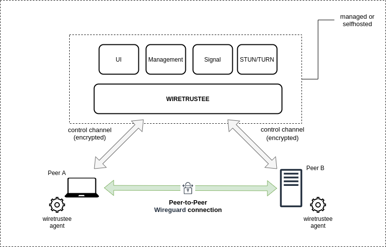

## Introduction

Wiretrustee is a WireGuard®-based platform that connects your devices securely into a peer-to-peer private network.

It simplifies VPN creation and management for your organization without the hassle of opening ports, complex firewall rules, and so forth.

It literally takes less than 5 minutes to provision a secure peer-to-peer VPN with Wiretrustee. 

### High-level overview
In essence, Wiretrustee is an open source platform consisting of a collection of systems, responsible for handling peer-to-peer connections, tunneling and network management (IP, keys, ACLs, etc).

    

Wiretrustee uses open-source technologies like [WireGuard®](https://www.wireguard.com/), [Pion ICE (WebRTC)](https://github.com/pion/ice), [Coturn](https://github.com/coturn/coturn),
and [software](https://github.com/wiretrustee/wiretrustee) developed by Wiretrustee authors to make it all work together.

To learn more about Wiretrustee architecture, please refer to the [architecture section](../docs/architecture.md).

### Getting Started

There are 2 ways of getting started with Wiretrustee:
- use Cloud Managed version
- self-hosting

We recommend starting with the cloud managed version hosted at [app.wiretrustee.com](https://app.wiretrustee.com) - the quickest way to get familiar with the system.
See [Quickstart Guide](../docs/quickstart.md) for instructions.

If you don't want to use the managed version, check out our [Self-hosting Guide](../docs/self-hosting.md).

