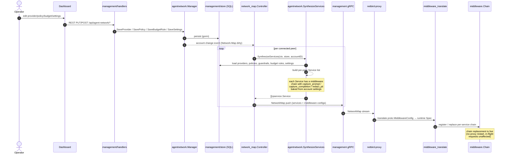
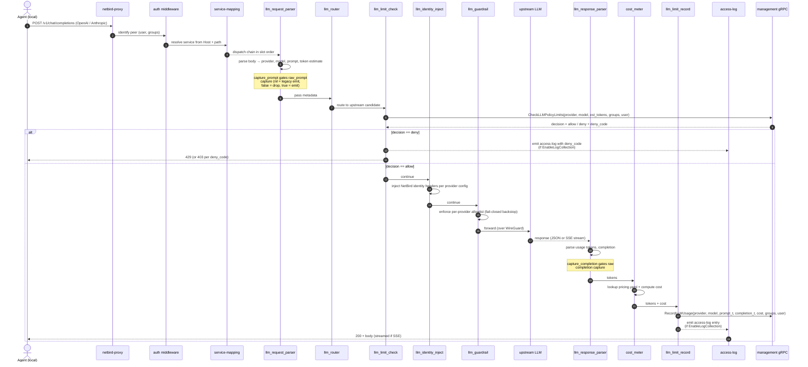

# End-to-end flows

Three cross-module mermaid diagrams. Each per-module guide repeats the
slice that's relevant to its own scope — these are the canonical
top-down views.

- [Flow A — Config → runtime (synth + deliver)](#flow-a--config--runtime-synth--deliver)
- [Flow B — Request lifecycle through the LLM chain](#flow-b--request-lifecycle-through-the-llm-chain)
- [Flow C — Budget rule feedback loop](#flow-c--budget-rule-feedback-loop)

---

## Flow A — Config → runtime (synth + deliver)

How an operator's change to a Provider, Policy, Guardrail, Budget Rule,
or Settings record ends up as live middleware on a peer's proxy.



**Notes on the diagram**

- The `network_map.Controller` synthesises on every push, not on a
  timer. A single config change costs O(connected peers × policies ×
  providers) per push. See [`modules/22-management-handlers-wiring.md`](modules/22-management-handlers-wiring.md).
- `SynthesizeServices` is the single source of truth for the wire
  format the proxy executes. Anything the proxy does that the
  synthesiser didn't request is a bug. See
  [`modules/21-management-agentnetwork.md`](modules/21-management-agentnetwork.md).
- The translate step (step 13) is the only place that knows the
  middleware-ID strings on the proxy side. It must reject unknown IDs;
  silently dropping middlewares would create a security gap (e.g.
  missing `llm_limit_check` ⇒ unbounded spend). See
  [`modules/33-proxy-runtime.md`](modules/33-proxy-runtime.md).

---

## Flow B — Request lifecycle through the LLM chain

What happens when an agent on the client peer sends a chat-completion /
messages request through the synthesised reverse-proxy.



**Notes on the diagram**

- The chain runs in synth-defined order. Re-ordering middlewares
  changes invariants — `llm_limit_check` must precede `llm_router` so
  a denied request never hits upstream, and `llm_limit_record` must
  pair with `llm_limit_check` so a successful check is always recorded
  (or the rate-limit semantics break). See
  [`modules/31-proxy-middleware-builtin.md`](modules/31-proxy-middleware-builtin.md).
- `llm_guardrail` is also where PII redaction happens
  (`redact_pii = settings.RedactPii`). Phones, emails, credit cards,
  PII names — see `redact.go` for the full set. See
  [`modules/31-proxy-middleware-builtin.md`](modules/31-proxy-middleware-builtin.md).
- The model allowlist is enforced in TWO places. `CheckLLMPolicyLimits`
  is authoritative: it resolves the policy that governs this
  (provider, caller-groups) and denies (`deny_code = llm_policy.model_blocked`)
  when no applicable policy permits the model — so an allowlist scoped to
  one group/provider never leaks to another, and an un-guardrailed policy
  is genuinely unrestricted. `llm_guardrail` is a per-provider fail-closed
  backstop: it only carries an allowlist for a provider every authorising
  policy restricts, and blocks unknown/undetermined models even when
  management is unreachable.
- SSE streaming requires special handling on the response side; the
  parser must handle partial chunks without buffering the whole
  stream. See [`modules/32-proxy-llm-parsers.md`](modules/32-proxy-llm-parsers.md).
- Access-log emission is gated on `settings.EnableLogCollection`. With
  it OFF, neither the deny nor the allow leg writes an entry — the
  chain still runs (budget rules are still enforced) but no audit trail
  is kept. See
  [`modules/33-proxy-runtime.md`](modules/33-proxy-runtime.md).

---

## Flow C — Budget rule feedback loop

How an account's budget rules tighten ceilings on every request and how
consumption flows back into the dashboard.

```mermaid
flowchart LR
    subgraph Operator
      DashBud[Dashboard Budget Settings tab]
    end
    subgraph Mgmt[Management]
      Save[POST/PUT /api/agent-network/budget-rules]
      Store[(SQL store)]
      Synth[SynthesizeServices]
      Check[CheckLLMPolicyLimits RPC]
      Rec[RecordLLMUsage RPC]
      Cons[/api/agent-network/consumption]
    end
    subgraph Proxy[Proxy]
      Chk[llm_limit_check]
      RecMw[llm_limit_record]
    end
    subgraph DashView[Dashboard Budget Dashboard tab]
      Panel[AgentConsumptionPanel]
    end

    DashBud -->|create / update rules| Save
    Save --> Store
    Store --> Synth
    Synth -->|push synth-services to peer| Proxy

    Chk -->|per request| Check
    Check -->|aggregate matching rules<br/>min-wins all-must-pass| Store
    Check -->|allow / deny| Chk

    RecMw -->|post-response| Rec
    Rec -->|tokens + cost + groups + user| Store

    Store -->|read counters| Cons
    Cons --> Panel
```

**Notes on the diagram**

- **min-wins all-must-pass** is the core semantic. A budget rule binds
  to (group set, user set) with a (window, ceiling). At check time,
  every rule that matches the caller is evaluated; if ANY rule has
  zero remaining quota the request is denied. This is the most
  surprising semantic for operators — see the invariants section of
  [`modules/21-management-agentnetwork.md`](modules/21-management-agentnetwork.md).
- The proxy never makes its own budget decisions. It always asks
  management via `CheckLLMPolicyLimits` and reports back via
  `RecordLLMUsage`. This keeps account-wide accounting in one place
  and avoids per-proxy drift.
- `RecordLLMUsage` must carry `group_ids` and `user_id` so the
  decrement hits the right rule(s). The wire that carries those
  fields onto the response leg is `respInput` in `reverseproxy.go`. See
  [`modules/33-proxy-runtime.md`](modules/33-proxy-runtime.md).
- The dashboard's Budget Dashboard tab polls
  `/api/agent-network/consumption` — not gRPC, not WebSocket. Poll
  interval lives in `AgentConsumptionPanel.tsx`. See
  [`modules/40-dashboard.md`](modules/40-dashboard.md).

---

## Cross-references

- Per-module guides: [`modules/`](modules/)
- Overview + module map: [`00-overview.md`](00-overview.md)
