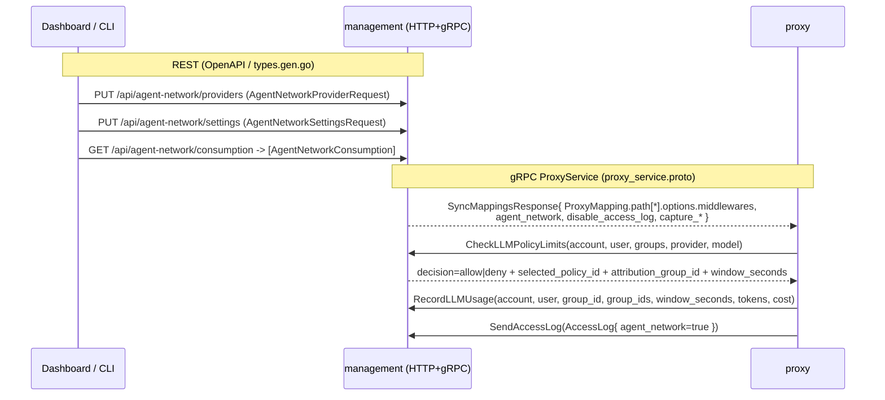

# shared/api — wire contracts (proto + OpenAPI)

> **Reviewer profile:** API/contracts maintainer; protobuf field-number discipline + oapi-codegen experience; needs to recognise additive vs. breaking schema changes.
> **Time to review:** 30-45 minutes
> **Risk level:** Medium — wire-format surface that every other module pins against; backward-compat hinges on field-number discipline more than on logic correctness.
> **Backward-compat impact:** Additive only (new proto fields use unallocated numbers, new RPCs default to `Unimplemented`, new OpenAPI schemas/paths are append-only; no existing field/RPC/schema removed or renumbered).

## Module boundary
This module owns the cross-process contract surface between management, proxy, and dashboard. Two artefacts: `shared/management/proto/proxy_service.proto` (management↔proxy gRPC) and `shared/management/http/api/openapi.yml` (dashboard/CLI↔management REST). Both have generated companions checked in (`proxy_service.pb.go`, `proxy_service_grpc.pb.go`, `types.gen.go`) which must travel in lockstep with their sources. `shared/management/status/error.go` is in scope only for the four new typed `NotFound` constructors that the new HTTP handlers return.

Everything downstream — `management/agentnetwork`, `management/server/http/handlers/*`, `proxy/internal/*`, the dashboard SDK — consumes these types verbatim. A review here is about wire stability and codegen reproducibility, not behaviour: the behaviour reviews live in the management and proxy module guides.

## Commits in scope
| SHA | Subject | LOC delta (this scope) |
| --- | ------- | --------- |
| 06ff17b38 | AN-0: additive proto + OpenAPI schemas + base types | +2374 / -774 (yml + types.gen.go regenerated) |
| f810a4e35 | AN-1: store layer for providers/policies/guardrails/settings | +1 status/error.go (NotFound helpers — providers/policies/guardrails) |
| a436b5fb3 | GC-0: account budget rule type + collection toggles + store CRUD | +1 status/error.go (`NewAgentNetworkBudgetRuleNotFoundError`) |
| b22d5a181 | GC-2: enforce account budget rules as a min-wins ceiling | proto: `RecordLLMUsageRequest.group_ids = 8` |
| 23bdf6871 | GC-4: HTTP API for budget rules + settings update | +293/+72 openapi.yml/types.gen.go (BudgetRule schemas, settings PUT) |
| 468875cb4 | Wire EnableLogCollection to suppress access-log | proto: `PathTargetOptions.disable_access_log = 13` |

`management.proto` and `signalexchange.proto` are unchanged. `status/error.go` only receives four additive constructors (lines 208-227); no existing error types are reshaped.

## Files changed
| Path | Status | LOC | Role |
| ---- | ------ | --- | ---- |
| `shared/management/proto/proxy_service.proto` | Modified | +125 / -0 | Source of truth: 2 new RPCs, 1 new message group (`MiddlewareConfig` + slot enum), additive fields on `PathTargetOptions`, `AccessLog`, `RecordLLMUsageRequest` |
| `shared/management/proto/proxy_service.pb.go` | Regenerated | +1932 / -1023 | protoc-gen-go v1.26.0 / protoc v7.34.1 output |
| `shared/management/proto/proxy_service_grpc.pb.go` | Regenerated | +88 / -0 | Adds `CheckLLMPolicyLimits` + `RecordLLMUsage` client/server stubs and `UnimplementedProxyServiceServer` defaults |
| `shared/management/http/api/openapi.yml` | Modified | +2371 / -... | 15 new `AgentNetwork*` schemas, 9 new path groups under `/api/agent-network/*` |
| `shared/management/http/api/types.gen.go` | Regenerated | +504 / -0 | oapi-codegen v2.7.0 output (per commit msg; see codegen note below) |
| `shared/management/status/error.go` | Modified | +20 / -0 | Four `NotFound` constructors for the new resource kinds (lines 208-227) |

## Architecture & flow

The proto changes split into three independent slices: (1) **mapping enrichment** — `PathTargetOptions` grows fields 8-13 so management can ship middleware configs, capture limits, and the agent-network / log-suppression flags down to the proxy without a second RPC; (2) **two new request/response RPCs** (`CheckLLMPolicyLimits`, `RecordLLMUsage`) for per-LLM-request budget arbitration; (3) **observability tag** — `AccessLog.agent_network` so management can route logs to the right surface.

The OpenAPI side is a thin CRUD surface — every resource (`Provider`, `Policy`, `Guardrail`, `BudgetRule`, `Settings`) follows the same `GET-list / POST / GET / PUT / DELETE` pattern, plus a read-only `/consumption` listing and a catalog endpoint. The `*Request` variants drop server-controlled fields (id, timestamps). `AgentNetworkBudgetRule` deliberately reuses `AgentNetworkPolicyLimits` to keep wire-shape parity with policies (GC-4 commit msg).

## Public contracts added
- gRPC RPCs (`proxy_service.proto:52-57`): `CheckLLMPolicyLimits(CheckLLMPolicyLimitsRequest) → CheckLLMPolicyLimitsResponse`, `RecordLLMUsage(RecordLLMUsageRequest) → RecordLLMUsageResponse`. Both unary; default `UnimplementedProxyServiceServer` returns `codes.Unimplemented` (`proxy_service_grpc.pb.go:283-289`).
- New messages (`proxy_service.proto:145-175,448-502`): `MiddlewareConfig`, `MiddlewareSlot` enum, `CheckLLMPolicyLimitsRequest`/`Response`, `RecordLLMUsageRequest`/`Response`.
- New `PathTargetOptions` fields 8-13 (`proxy_service.proto:124-140`): `capture_max_request_bytes`, `capture_max_response_bytes`, `capture_content_types`, `middlewares`, `agent_network`, `disable_access_log`. All default-false / zero; pre-existing fields 1-7 byte-for-byte unchanged.
- `AccessLog.agent_network = 18` (`proxy_service.proto:258-261`).
- `RecordLLMUsageRequest.group_ids = 8` (`proxy_service.proto:496-498`) — added in GC-2 specifically so the record path can fan out to every applicable budget rule's window without a re-lookup.
- 15 new OpenAPI component schemas (`openapi.yml:5072-5829`): `AgentNetworkProvider[Request|Model]`, `AgentNetworkCatalog{Model,Provider,IdentityInjection,HeaderPairInjection,JSONMetadataInjection,ExtraHeader}`, `AgentNetworkPolicy[Request|TokenLimit|BudgetLimit|Limits]`, `AgentNetworkGuardrail[Checks|Request]`, `AgentNetworkConsumption`, `AgentNetworkSettings[Request]`, `AgentNetworkBudgetRule[Request]`.
- 9 new path groups (`openapi.yml:12797-13460`): `/api/agent-network/{consumption,settings,budget-rules,budget-rules/{ruleId},catalog/providers,providers,providers/{providerId},policies,policies/{policyId},guardrails,guardrails/{guardrailId}}`.
- Four typed NotFound errors (`shared/management/status/error.go:208-227`).

## Invariants
- **Field-number monotonicity.** Every new proto field uses a previously-unallocated number in its message: `PathTargetOptions` 8-13 (was 1-7), `AccessLog` 18 (was 1-17), `RecordLLMUsageRequest` 8. `SendStatusUpdateRequest.inbound_listener = 50` (pre-existing) reserves 50+ for observability extensions, so 8 on `RecordLLMUsageRequest` doesn't conflict.
- **Old proxies stay compatible.** Old management never sends `disable_access_log`/`middlewares`/`agent_network` (zero value → existing behaviour); old proxies that don't decode these fields just drop them silently (proto3 unknown-field semantics) — log emission stays on. AN-0's commit message explicitly claims "private-service proto/OpenAPI content is byte-for-byte untouched (0 deletions in proxy_service.proto and openapi.yml)" — verify by diff stat that no pre-existing field number changed.
- **Old management stays compatible.** The two new RPCs are registered on the same `management.ProxyService` descriptor; old proxies hitting them get `codes.Unimplemented` from the unimplemented embed (`proxy_service_grpc.pb.go:283-289`), which is the same fallback pattern `SyncMappings` already documents (`proxy_service.proto:20-21`).
- **OpenAPI shapes are append-only.** New schemas are placed at the end of `components.schemas` (line 5072+); new paths at the end of `paths` (line 12797+). No existing schema's `required` list, enum, or property type was changed.
- **`*Request` vs response asymmetry.** Read shapes (`AgentNetworkProvider`, `AgentNetworkPolicy`, `AgentNetworkGuardrail`, `AgentNetworkSettings`, `AgentNetworkBudgetRule`) require `created_at`/`updated_at`; the matching `*Request` shapes do not — server fills them. `AgentNetworkProviderRequest.api_key` is write-only (`openapi.yml:5158-5161` "never returned in responses"); reviewers should confirm the response schema (5072-5138) actually omits `api_key`.

## Things to scrutinize
### Correctness
- `RecordLLMUsageRequest` carries both `group_id` (singular, the attribution group — field 3) and `group_ids` (plural, full membership — field 8). `b22d5a181` adds field 8 to drive account-budget fan-out; double-check that consumers can't accidentally key counters on the wrong one. Field comments at `proxy_service.proto:489-491` and `496-498` distinguish them but it's the kind of subtle thing a follow-up commit might collapse.
- `PathTargetOptions.disable_access_log` is the only field whose default-false meaning **changes semantics** on the proxy side: false → log (status quo), true → suppress. Synthesizer sets `DisableAccessLog = !settings.EnableLogCollection`, so a missing/default settings row yields `EnableLogCollection=false → DisableAccessLog=true → suppressed`. Worth confirming downstream (`agentnetwork.synthesizer`) that operator-defined private services never inherit this flag — the proto field default protects them, but only if synth code is explicit.
- `CheckLLMPolicyLimitsResponse.decision` is a free-form `string` (`proxy_service.proto:471`) rather than an enum. Only documented values are "allow" / "deny". An enum would prevent typo drift; consider before this RPC ships to external consumers.
- `deny_code` (`proxy_service.proto:478-481`) is documented as "a stable label" but is also a free string. Pin the allowed set somewhere observable to the proxy.

### Security
- `AgentNetworkProvider.api_key` MUST be write-only. Schema split (request has it at line 5158; response omits it) looks correct, but a regression here leaks the upstream provider credential to every dashboard reader. Check that the handler explicitly zeros it on the response path.
- `extra_values` / `identity_header_*` headers on `AgentNetworkProvider` get stamped onto upstream requests. Description at `openapi.yml:5099` says "values not declared by the catalog are ignored at synth time" — a contract this module documents but the synthesizer must enforce. Confirm the synth module honours it.
- Cluster + subdomain on `AgentNetworkSettings` are documented immutable (`openapi.yml:5686-5694`) and the `AgentNetworkSettingsRequest` (lines 5733-5752) doesn't accept them. Verify the `PUT /api/agent-network/settings` handler can't be tricked by extra JSON keys (oapi-codegen's `additionalProperties: false` is not declared here; spec defaults to permissive).

### Backward compatibility
- The proto file claims field-number additivity; spot-check by diffing the merge-base proto against HEAD — every numbered field present at merge-base must still have the same name + type. The AN-0 commit message asserts "0 deletions in proxy_service.proto"; `git diff --stat` shows 125 insertions and 0 deletions, so this holds at the source-text level.
- `proxy_service_grpc.pb.go` adds two RPC handlers and registers them in `ProxyService_ServiceDesc.Methods` (lines 543-552). The existing entries are unchanged and order-preserving — gRPC method dispatch is name-keyed, so order doesn't matter, but reviewing the diff (no method renamed/dropped) is still worth a glance.
- OpenAPI 3.0 doesn't have a built-in deprecation flow for paths; if any client tooling iterates `paths.*`, the additive routes shouldn't break it, but generated SDKs (especially the dashboard's) need a regen to gain access to `AgentNetwork*`.

### Codegen pinning
- `generate.sh` (`shared/management/http/api/generate.sh:14`) installs `oapi-codegen@latest`, yet the AN-0 commit message claims v2.7.0 was used. **This is a reproducibility gap** — re-running the script tomorrow may produce a different `types.gen.go`. Either pin the version in `generate.sh` (`@v2.7.0`) or document the pin in a `tools.go`.
- proto codegen has the protoc version stamped in the generated file header (`proxy_service.pb.go:3-4` — protoc-gen-go v1.26.0 / protoc v7.34.1), matching the commit message. Good.
- Reviewers should regenerate locally and confirm zero diff against the committed `types.gen.go` / `proxy_service.pb.go` before merge.

## Test coverage
| Test file | Locks down |
| --------- | ---------- |
| None in this scope | The proto and OpenAPI sources are tested transitively by the handler tests (`shared/management/http/handlers/agentnetwork/...`) and by the synthesizer/manager tests (`management/server/agentnetwork/...`). No round-trip serialisation test exists in the `proto/` or `api/` packages themselves. |
| `shared/management/proto/*_test.go` | (absent) |
| `shared/management/http/api/*_test.go` | (absent) |

Acceptable for codegen artefacts, but a single golden-file test that re-runs `oapi-codegen` and `protoc` in CI and diffs against the checked-in files would close the reproducibility gap noted above.

## Known limitations / explicit non-goals
- **No deprecation surface.** Old fields/RPCs are kept silently; there is no `[deprecated = true]` annotation on anything. Acceptable here because nothing is being removed.
- **No proto-side validation.** Numeric ranges (e.g. `window_seconds >= 60`, `cost_usd >= 0`, capture-byte clamps) are enforced in the OpenAPI schema via `minimum:` and inside Go code by the proxy/management, but `proto3` itself can't express them; downstream is expected to validate every message.
- **`MiddlewareConfig.config_json` is `bytes`** (`proxy_service.proto:163`) — opaque to the proto layer. Schema validity is the middleware factory's problem. This is a deliberate tradeoff (per the comment at 161-162) but worth flagging: a corrupted/malicious config_json can only fail at proxy apply time, not at the wire-decode step.
- **No catalog endpoint schema for the catalog itself** — the catalog data ships as a `GET /api/agent-network/catalog/providers` returning `[AgentNetworkCatalogProvider]` (`openapi.yml:13024`), but the catalog source-of-truth lives in `management/server/agentnetwork/catalog`, not here.
- AN-0's commit message notes "Reaper design dropped per scope decision; not migrated." No reaper-related types appear in this scope — confirmed.

## Cross-references
- Downstream: [management/store](20-management-store.md), [management/agentnetwork](21-management-agentnetwork.md), [management/http handlers](22-management-http-handlers.md), [proxy/runtime](33-proxy-runtime.md)
- End-to-end flow: [../01-end-to-end-flows.md](../01-end-to-end-flows.md)
- Top-level: [../00-overview.md](../00-overview.md)
