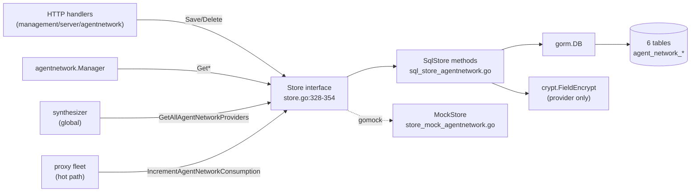

# management/store — persistence for agent-network entities

> **Risk level:** Medium — six brand-new tables behind AutoMigrate, one upsert-counter table that runs on the request hot path, and one column carrying an encrypted secret.
> **Backward-compat impact:** Additive (six new tables created by AutoMigrate; the `Store` interface gains 23 methods, but no existing column/index is touched).

## Module boundary

This module is the persistence layer for the Agent Network feature. Everything the management server stores about LLM proxying — providers, policies, guardrails, the per-account settings row, a usage-counter table written on every proxied LLM request, and the account-budget rules — flows through the methods added to `store.Store`. The module owns six tables, six entity types from `management/server/agentnetwork/types`, and a single hot-path upsert (`IncrementAgentNetworkConsumption`) consumed by the proxy fleet.

Out of scope here: the catalog of provider definitions (compiled-in, no DB), the synthesizer/manager built on top of these CRUDs (covered in [21-management-agentnetwork.md](21-management-agentnetwork.md)), and the HTTP handlers that translate API requests into Save/Delete calls.

## Files

| Path | Role |
| ---- | ---- |
| `management/server/store/sql_store_agentnetwork.go` | gorm implementations of all 23 store methods |
| `management/server/store/sql_store_agentnetwork_budgetrule_test.go` | round-trip + account-scoping coverage against a real sqlite store |
| `management/server/store/sql_store.go` | one import, six entities appended to the `AutoMigrate` slice (sql_store.go:40, sql_store.go:141-142) |
| `management/server/store/store.go` | 23 methods added to the `Store` interface (store.go:328-354) |
| `management/server/store/store_mock_agentnetwork.go` | mockgen output for the new interface surface |

## Tables added / migrations

All six tables are created by `db.AutoMigrate` invoked from `NewSqlStore` at sql_store.go:133-143. There is no hand-rolled SQL migration script — the schema is whatever GORM derives from the struct tags.

- `agent_network_providers` — `Provider.TableName()` at provider.go:76. PK `id`, index on `account_id`, named index `idx_agent_network_provider` on `provider_id`. Carries an at-rest-encrypted `api_key` and ed25519 `session_private_key` (provider.go:35,56). `extra_values` and `models` are JSON blobs (`serializer:json`).
- `agent_network_policies` — `Policy.TableName()` at policy.go:70. PK `id`, index on `account_id`. JSON columns: `source_groups`, `destination_provider_ids`, `guardrail_ids`, `limits`.
- `agent_network_guardrails` — `Guardrail.TableName()` at guardrail.go:41. PK `id`, index on `account_id`. JSON `checks`.
- `agent_network_settings` — `Settings.TableName()` at settings.go:33. PK `account_id` (one row per account), named index `idx_agent_network_settings_cluster_subdomain` on `subdomain` only — the index name implies a composite, but only one column is tagged.
- `agent_network_consumption` — `Consumption.TableName()` at consumption.go:46. Composite PK across `(account_id, dim_kind, dim_id, window_seconds, window_start_utc)` — the same tuple the upsert keys on.
- `agent_network_budget_rules` — `AccountBudgetRule.TableName()` at budgetrule.go:35. PK `id`, index on `account_id`. JSON `target_groups`, `target_users`, `limits`.

## CRUD surface added

Provider, Policy, Guardrail, BudgetRule follow the same pattern: `Get<Kind>ByID`, `GetAccount<Kind>` (list), `Save<Kind>` (upsert), `Delete<Kind>`, with account-scoping enforced by the existing `accountAndIDQueryCondition` / `accountIDCondition` constants (sql_store.go:59-62). Provider additionally exposes `GetAllAgentNetworkProviders` (cross-account, used by the synthesizer). Settings exposes `Get`/`GetByCluster`/`Save` (no delete — one row per account, created on first save). Consumption exposes the upsert `Increment`, a point `Get`, and a cross-window `List`.

## Architecture & flow

Reads decrypt provider secrets in-place; writes do `provider.Copy().EncryptSensitiveData(...)` before `db.Save` so the caller's in-memory object keeps the plaintext `api_key` (sql_store_agentnetwork.go:88-102). Every list/get takes a `LockingStrength` and applies `clause.Locking{Strength: ...}` when non-`None` — matching the rest of the store. The upsert path uses `clause.OnConflict` with `gorm.Expr` server-side increments so concurrent proxy nodes converge without read-modify-write races (sql_store_agentnetwork.go:321-335).

## Invariants enforced at the store layer

- **Account scoping.** Every entity-by-ID method keys on `account_id = ? and id = ?`; no cross-tenant leak path through the API is reachable as long as callers always pass the auth'd `accountID` (sql_store_agentnetwork.go:70,141,201,429).
- **NotFound mapping.** `gorm.ErrRecordNotFound` is translated to typed `status.NewAgentNetwork*NotFoundError`; `Delete*` returns NotFound when `RowsAffected == 0` (sql_store_agentnetwork.go:111-113,171-173,231-233,461-463).
- **Provider secret encryption at rest.** `SaveAgentNetworkProvider` always encrypts before persist; `Get*` always decrypts after read. The plaintext `api_key` never reaches the DB through this layer (sql_store_agentnetwork.go:31,54,80,90).
- **Consumption monotonicity.** The upsert only ever issues `col = col + ?` for the three counter columns — no decrement path exists (sql_store_agentnetwork.go:330-332).
- **Window alignment is the caller's responsibility.** The store stamps `WindowStartUTC` as-passed; alignment to epoch happens in `types.WindowStart` at consumption.go:51-58.
- **Settings has no Delete.** Intentional — one row per account, created on first save; the row sticks around for the account lifetime.

## Things to scrutinize

### Correctness
- `SaveAgentNetworkProvider` saves the copy (sql_store_agentnetwork.go:95). The caller's in-memory pointer therefore keeps plaintext `api_key` and any `CreatedAt`/`UpdatedAt` gorm autofills land on the copy, not the original. Callers that need synced timestamps must re-fetch.
- `IncrementAgentNetworkConsumption`'s `Create` provides initial counter values (`TokensInput: tokensIn`, etc.) in the row, and on conflict the assignments add the same deltas to the existing values. The insert-vs-update arithmetic is consistent. Cross-check that no engine in use (sqlite, postgres, mysql) silently rejects the `OnConflict` clause — GORM emits engine-specific SQL but `ON DUPLICATE KEY UPDATE` (mysql) vs `ON CONFLICT (...)` (sqlite/postgres) need their unique constraint to match the composite PK on `agent_network_consumption`; it does, by construction.
- `IncrementAgentNetworkConsumption` writes `updated_at: time.Now().UTC()` literally inside the assignments map (sql_store_agentnetwork.go:333) — fine, but it's a Go-side timestamp captured at call time, not a DB-side `now()`. Acceptable for an audit field.
- `GetAgentNetworkConsumption` returns a zero-valued non-nil row on `ErrRecordNotFound` (sql_store_agentnetwork.go:364-371). Document or rename — a typed sentinel error would be more orthodox; callers must know not to error-check.

### Concurrency / transactions
- Hot-path `IncrementAgentNetworkConsumption` runs outside any explicit transaction; concurrency safety relies entirely on the DB serialising the `ON CONFLICT` upsert against the composite PK. This is correct for postgres and mysql; for sqlite it serialises behind the single writer.
- `SaveAgentNetworkSettings` is a blind upsert with no version/etag — concurrent writes from two operators last-write-wins on the collection-toggle flags (settings.go:23-25). Acceptable for admin-curated state but worth flagging.
- `Save*Provider` uses `db.Save` on a struct with a PK already set — GORM emits UPDATE or INSERT based on row existence. No upsert clause is attached, so a race between two creates with the same generated `xid` (vanishingly unlikely) would surface as a PK violation.

### Migration safety
- All six tables ride `AutoMigrate` (sql_store.go:141-142). AutoMigrate is additive: new columns get added, but it never drops columns nor narrows types. Three `bool` columns on `agent_network_settings` (`EnableLogCollection`, `EnablePromptCollection`, `RedactPii`) default to false at the GORM/DDL layer for existing rows; the test at sql_store_agentnetwork_budgetrule_test.go:83-112 locks that down on a fresh sqlite. Verify postgres/mysql produce the same default.
- The named index `idx_agent_network_settings_cluster_subdomain` on settings.go:15 is declared on only `subdomain`. Either the cluster column also needs `gorm:"index:idx_agent_network_settings_cluster_subdomain"` to make it composite, or the name is misleading.
- The named index `idx_agent_network_provider` on `Provider.ProviderID` (provider.go:30) is *not* unique and not scoped to account — two providers in the same account with the same `provider_id` are permitted at the DB layer; uniqueness, if any, must live above the store.

### Backward compatibility
- Net additive. No removed methods, no renamed columns, no schema change to existing tables. Existing deployments running a prior binary continue to work; the first boot of the new binary creates the six tables.
- The `Store` interface grows by 23 methods (store.go:330-354); any non-mock external implementer of `store.Store` will fail to compile. The repo only has `SqlStore` + `MockStore`, both updated.

### Performance (indexes, N+1)
- All by-account list queries hit the `idx_account_id` per-table index. No N+1: list methods return the full slice in one query.
- `GetAgentNetworkSettingsByCluster` (sql_store_agentnetwork.go:263-277) does a tablescan on `cluster` — no index. Tolerable for the bootstrap label generator (one-shot at provisioning) but worth noting if the call moves onto a hot path.
- `ListAgentNetworkConsumption` returns every row ever recorded for the account (sql_store_agentnetwork.go:382-400) — unbounded growth, no `LIMIT`, no time filter. With one row per (dim, window) per request burst, this table grows fastest of the six; a retention job + a paginated list method are obvious follow-ups.

## Test coverage

| Test file | Locks down |
| --------- | ---------- |
| `sql_store_agentnetwork_budgetrule_test.go::TestAgentNetworkBudgetRule_RealStore_RoundTrip` | full save → reload of `AccountBudgetRule` including the JSON-serialised `PolicyLimits`, target slices, double-delete returns NotFound (lines 18-59) |
| `sql_store_agentnetwork_budgetrule_test.go::TestAgentNetworkBudgetRule_RealStore_ScopedByAccount` | cross-account isolation for budget rules (lines 63-78) |
| `sql_store_agentnetwork_budgetrule_test.go::TestAgentNetworkSettings_RealStore_CollectionTogglesRoundTrip` | collection toggles default off, survive save/reload at the set values (lines 83-112) |

Gap: there is no store-level test for providers (encryption round-trip), policies, guardrails, or `IncrementAgentNetworkConsumption` (concurrent upsert, window-key uniqueness). The consumption upsert is the most performance-sensitive method in this module and the only one without a real-sqlite test.

## Known limitations / explicit non-goals

- No retention / GC for `agent_network_consumption`.
- No `Delete` for `Settings` (one row per account, cleared with the account).
- No DB-engine-specific tuning — the same struct tags drive sqlite, mysql, postgres.
- Provider `extra_values` and `models` are JSON blobs; querying inside them is not supported by design.
- `GetAgentNetworkConsumption` "not-found = zero row" contract is convenient but unconventional.

## Cross-references

- Upstream: [shared/api](10-shared-api.md), [management/agentnetwork](21-management-agentnetwork.md)
- End-to-end flow: [../01-end-to-end-flows.md](../01-end-to-end-flows.md)
- Top-level: [../00-overview.md](../00-overview.md)
