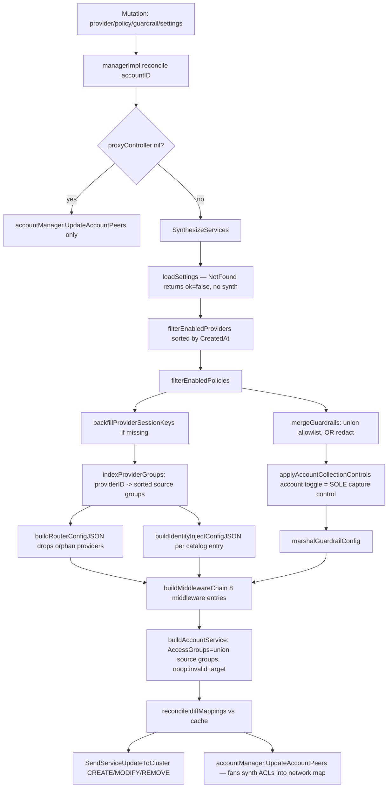
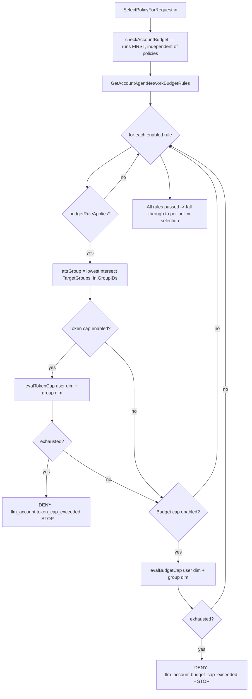
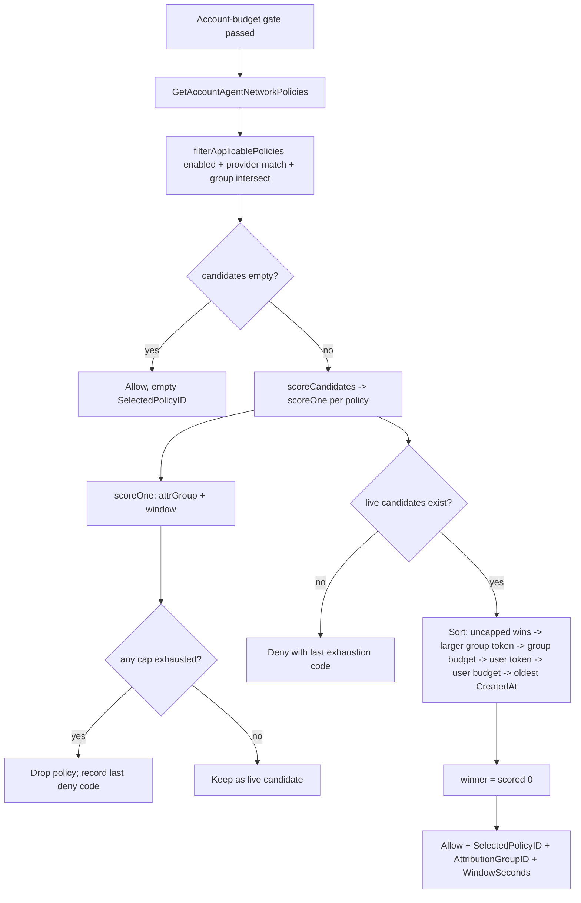

# management/agentnetwork — domain layer + synth pipeline

> **Risk level:** High — central business logic + budget enforcement + the source of every middleware-chain change the proxy executes.
> **Backward-compat impact:** Additive within the agent-network surface; one **behavioural difference for opted-out accounts** in parser capture (the capture flag is stamped explicitly false instead of being absent — see capture-pointer semantics below). Non-agent-network proxy services are untouched (the synth chain only ships on `agent-net-svc-*` targets).

## Module boundary

`management/server/agentnetwork` owns every agent-network entity (providers, policies, guardrails, account budget rules, per-account settings, consumption rows) and **translates them into the in-memory `*rpservice.Service` that the reverse-proxy controller turns into `proto.ProxyMapping`s and pushes to clusters**. It is the *only* writer of the agent-network middleware chain.

Inside the package: `manager.go` is the CRUD + permissions-gated facade; `synthesizer.go` walks settings + providers + policies + guardrails and emits the per-account service plus every middleware's JSON config; `policyselect.go` runs per-request attribution (min-wins account ceiling, then "drain bigger pool first"); `reconcile.go` diffs successive synth outputs and emits precise Create/Update/Delete proxy-mapping updates plus a peer-map refresh. `labelgen/` mints DNS-safe subdomain labels; `catalog/` is the static provider catalogue; `types/` carries gorm entity structs. The `_realstack_test.go` files in the parent `management/server/` directory exercise the manager + network-map controller end-to-end with no mocks.

## Files

| Path | Role |
| ---- | ---- |
| `agentnetwork/manager.go` | Manager interface + CRUD + permission gates + bootstrap-settings + reconcile trigger |
| `agentnetwork/synthesizer.go` | Settings/policy → wire-format synthesis; sole writer of the proxy middleware chain |
| `agentnetwork/policyselect.go` | Per-request policy attribution + account-budget ceiling (min-wins) |
| `agentnetwork/reconcile.go` | Per-account synth diff vs in-memory cache → Create/Update/Delete |
| `agentnetwork/catalog/catalog.go` | Static provider catalogue (auth headers, identity-injection shapes) |
| `agentnetwork/labelgen/{labelgen,words}.go` | DNS-safe subdomain picker + curated wordlist |
| `agentnetwork/types/provider.go` | Provider entity + APIKey + Models + ExtraValues + SessionKeys |
| `agentnetwork/types/policy.go` | Policy entity + `PolicyLimits` (token + budget) |
| `agentnetwork/types/guardrail.go` | Guardrail entity (`ModelAllowlist`, `PromptCapture`) |
| `agentnetwork/types/budgetrule.go` | `AccountBudgetRule` (reuses `PolicyLimits`) |
| `agentnetwork/types/settings.go` | Per-account `Settings` (Cluster, Subdomain, 3 toggles) |
| `agentnetwork/types/consumption.go` | `Consumption` row + `WindowStart` aligner |
| `agentnetwork/{synthesizer,policyselect,reconcile,wire_shape}_*test.go` | See test coverage table |
| `agentnetwork/types/consumption_test.go` | `WindowStart` alignment proofs |
| `agentnetwork/labelgen/labelgen_test.go` | Deterministic picks + exhaustion + fallback |
| `management/server/agentnetwork_realstack_test.go` | No-mock provider CRUD → network-map fan-out |
| `management/server/agentnetwork_budgetrule_realstack_test.go` | No-mock budget-rule CRUD + settings preserve-immutable |

## Architecture & flow

### Synthesis (settings/policy → wire format)

### Budget rule resolution (min-wins, group+user bound)

Key invariant: **rules are checked sequentially and ANY exhausted rule denies (all-must-pass / min-wins).** Untargeted rules (`len(TargetGroups)==0 && len(TargetUsers)==0`) apply to every caller (`policyselect.go:393`).

### Policy selection (per-peer, per-request)

End-to-end: a mutation calls `managerImpl.reconcile(ctx, accountID)` (`manager.go:205,239,...`). Reconcile defers an `accountManager.UpdateAccountPeers` so the network-map controller re-runs and `injectAllProxyPolicies` picks up the new access groups; with a `proxyController` wired, it re-synthesizes the service, diffs against `reconcileCache[accountID]` (guarded by `reconcileMu`), and emits proto mappings to the cluster derived from the mapping's domain (`reconcile.go:120`). Synthesis is stateless and idempotent. Sole persistent side effect: `backfillProviderSessionKeys` (`synthesizer.go:249`) mints ed25519 keys on legacy provider rows and writes them back.

At request time the path is independent: the proxy calls `SelectPolicyForRequest` (`policyselect.go:56`); account-budget ceiling first, then per-policy scoring. Token + budget caps share `evalTokenCap` / `evalBudgetCap` — same primitive for account rules and policy limits, `label` differentiates the deny reason. After a served request, `RecordAccountBudgetUsage` (`policyselect.go:415`) fans deltas to every applicable rule's distinct `(dim_kind, dim_id, window)` tuple, deduplicating to prevent double-count when two rules share target+window.

## Public contracts

- **Manager interface** (`manager.go:48-80`): CRUD for `Providers/Policies/Guardrails/BudgetRules`; `GetSettings/UpdateSettings` (cluster + subdomain immutable, only the three toggles mutate); `ListConsumption/RecordConsumption(account, kind, dimID, windowSec, in, out, USD)`; `RecordAccountBudgetUsage(account, user, groups, in, out, USD)`; `SelectPolicyForRequest(ctx, PolicySelectionInput) → *PolicySelectionResult{Allow, SelectedPolicyID, AttributionGroupID, WindowSeconds, DenyCode, DenyReason}`.
- **`PolicySelectionInput`** (`manager.go:85-90`): `{AccountID, UserID, GroupIDs, ProviderID}` — populated by the proxy from CapturedData + `llm_router` resolution.
- **Synthesized middleware chain** (`synthesizer.go:576-657`), order load-bearing — response slot runs reverse-of-slice:

  | Slot | Idx | ID | ConfigJSON shape | CanMutate |
  | --- | --- | --- | --- | --- |
  | on_request | 0 | `llm_request_parser` | `{"capture_prompt": <bool>, "redact_pii"?: true}` | – |
  | on_request | 1 | `llm_router` | `{"providers":[{id, models[], upstream_*, auth_header_*, allowed_group_ids[]}]}` | **true** |
  | on_request | 2 | `llm_limit_check` | `{}` | – |
  | on_request | 3 | `llm_identity_inject` | `{"providers":[{provider_id, header_pair?, json_metadata?, extra_headers?}]}` | **true** |
  | on_request | 4 | `llm_guardrail` | `{"model_allowlist"?, "prompt_capture":{enabled,redact_pii}}` | – |
  | on_response | 5 | `llm_limit_record` | `{}` (runs LAST at runtime) | – |
  | on_response | 6 | `cost_meter` | `{}` | – |
  | on_response | 7 | `llm_response_parser` | `{"capture_completion": <bool>, "redact_pii"?: true}` | – |
- **Synthesized service shape** (`synthesizer.go:739`): `Mode=HTTP`, `Private=true`, `Domain=<subdomain>.<cluster>`, `AccessGroups=unionSourceGroups(enabledPolicies)`, one `TargetTypeCluster` target with `Host=noop.invalid:443` (router rewrites per request), `Options.{DirectUpstream,AgentNetwork}=true`, `DisableAccessLog=!settings.EnableLogCollection`, `CaptureMax{Req,Resp}Bytes=1<<20`, `CaptureContentTypes=["application/json","text/event-stream"]`.

## Invariants

- **Min-wins / all-must-pass for account budget rules** (`checkAccountBudget`, `policyselect.go:353`): every applicable enabled rule is checked; first exhausted cap denies. Untargeted rules bind every caller.
- **Account toggle is the SOLE control for capture enablement.** `applyAccountCollectionControls` (`synthesizer.go:701`) sets `merged.PromptCapture.Enabled = settings.EnablePromptCollection` *unconditionally*.
- **Capture-pointer semantics on parser configs** — see "Things to scrutinize" below.
- **`EnableLogCollection` ↔ `DisableAccessLog` is the only access-log toggle** (`synthesizer.go:770`). Default off ⇒ access log suppressed.
- **`RedactPii` flows verbatim to BOTH parsers** (`synthesizer.go:584-585`) and is OR'd into the merged guardrail (`synthesizer.go:706`).
- **Cluster and Subdomain are immutable on Settings.** `UpdateSettings` reloads existing row and overlays only the three toggles (`manager.go:558-561`).
- **Orphan providers (no enabled policy authorises them) NEVER reach the router** (`synthesizer.go:351-357`); skipped from `identity_inject` for symmetry.
- **Provider creation refuses empty `api_key`** (`manager.go:175`); **deletion refuses while any policy still references it** (`manager.go:265-273`).
- **Session keypair stability across provider edits** (`manager.go:226-228`) — server-managed, copied through every `UpdateProvider`, never API-surfaced.

## Things to scrutinize

### Correctness

- **Capture-pointer semantics — `*bool` vs `bool`.** Three states, owned by separate sides:
  - **Wire JSON this module emits:** `buildParserConfigJSON` (`synthesizer.go:678-693`) *always* stamps the capture field. Agent-network targets ship `"capture_prompt": false` or `"capture_prompt": true` — never absent. Same for `"capture_completion"`. The happy-path test pins `{"capture_prompt":false}` (`synthesizer_test.go:174`).
  - **Proxy-side parser config (consumer):** parsers decode into `*bool`. Matrix:
    - `nil` (field absent) → **legacy default = emit**. Preserved for non-agent-network callers and pre-existing tests (the backward-compat hook).
    - `false` (field present, value false) → **suppress emission entirely**. The behaviour for opted-out agent-network accounts. Without this, `enable_log_collection=true` + `enable_prompt_collection=false` would leak raw user input AND raw model output to the access log.
    - `true` → emit normally.
  - **Why the synth always stamps a value:** an agent-network mapping omitting the field would hit legacy "always emit" and re-introduce the leak. The `json.Marshal` error fallback at `synthesizer.go:687` degrades to `{}` — comment-claimed unreachable, but if ever fired re-introduces the leak. Consider fail-closed (return literal `{"capture_prompt":false}`) instead.
- **`scoreCandidates` non-cumulative deny code.** Only the *last* exhausted policy's deny code survives (`policyselect.go:188-190`). Iteration order is store's natural order. Auth signal is `len(scored)==0`, so this is informational only — verify no UI depends on "first exhausted policy" semantics.
- **`effectiveWindowSeconds` token-wins tiebreak.** When both halves are enabled with different windows, token's window wins (`policyselect.go:482`). Verify `RecordLLMUsage` increments against the winning window only.
- **`RecordAccountBudgetUsage` dedup.** Two rules with the same `(kind, dim_id, window)` would double-count without the `tuples` map (`policyselect.go:434-449`). Key includes all three dimensions — correct.
- **Fail-closed on bad provider:** unknown catalog id (`synthesizer.go:794-796`) or empty API key (`synthesizer.go:801-803`) drops the **entire** account's synth, not just the bad provider. Confirm matches operator UX.

### Security

- **Redact OR-merge:** merged `RedactPii` = account OR guardrail (`synthesizer.go:706`). **Parser-side flag is `settings.RedactPii` only, NOT the OR** — a guardrail-only opt-in does not propagate to parsers. Correct because the account toggle gates capture, but worth noting on the proxy side.
- **Group resolution must not leak across accounts.** Every store call carries `accountID` (`policyselect.go:73, 286, 298, 322, 334, 354`); `lowestIntersect` uses caller's claimed groups only (`policyselect.go:494`). Risk surface is upstream (handler populates `in.GroupIDs`).
- **`UpdateSettings` preserves immutable Cluster + Subdomain** (`manager.go:558`). A client can't rebind the cluster.
- **Provider session keypair backfill writes through `SaveAgentNetworkProvider`** (`synthesizer.go:256`) from a read-shaped call. Idempotent → worst case is a wasted write under concurrent reconcile + snapshot.

### Concurrency

- **`reconcileMu`** guards `reconcileCache`. Lock window is narrow — compute diff inside, send outside (`reconcile.go:56-68`).
- **`labelRngMu`** guards `labelRng` because `math/rand.Source` is unsafe for concurrent use (`manager.go:638-640`).
- **Real-store tests** use `store.NewTestStoreFromSQL` with `t.TempDir()` per test — no shared state, no `t.Parallel()`.
- **`RecordAccountBudgetUsage` dedup `tuples` map is per-call;** concurrent calls fan out fully — correct (each request's tokens book once per applicable rule).
- **Deferred `UpdateAccountPeers` runs inline after the proxy push** (`reconcile.go:28-35`); a slow call stretches CRUD response time.

### Backward compatibility

- **Capture-pointer semantics (restated):** non-agent-network callers see no field → legacy nil-default emit, identical to pre-PR. Agent-network targets always carry an explicit `capture_*` value.
- **`TestSynthesizeServices_HappyPath` was updated:** request-parser config moved from `{}` to `{"capture_prompt":false}` (`synthesizer_test.go:174`). External snapshot tests against synth output need updating.
- **`MergedGuardrails` retains zeroed `TokenLimits`/`Budget`/`Retention`** even though `Policy.Limits` carries the real values now; `llm_limit_check` is the authoritative enforcement. Comment at `synthesizer.go:940-948` calls this out.

### Performance

- **`SynthesizeServices` runs on every controller tick / mutation reconcile.** Cost: 4 store reads + optional per-provider keypair backfill. Sort + index + merge are O(N log N) / O(P × G); dominant cost is JSON marshalling. No nested loops escape these dimensions.
- **`reconcile.diffMappings` is O(N + M)** with N=M=1 per account today — effectively constant.
- **`SynthesizeServicesForCluster`** (`synthesizer.go:71`) walks every account on a cluster; per-account failures are **swallowed** (`synthesizer.go:91-93`) so a single misconfigured account doesn't drop the cluster. Runs per proxy reconnect.

### Observability

- **Activity codes:** `AgentNetwork{Provider,Policy,Guardrail,BudgetRule}{Created,Updated,Deleted}`; `AgentNetworkSettingsUpdated` with `log_collection/prompt_collection/redact_pii` payload (`manager.go:567-571`). **No activity code for `SelectPolicyForRequest` denies** — surfaced via proxy access log only (likely intentional given volume).
- **Deny codes** namespaced: `llm_policy.{token,budget}_cap_exceeded`, `llm_account.{token,budget}_cap_exceeded` (`policyselect.go:18-26`).
- **Reconcile failures are logged at warn and swallowed** (`reconcile.go:42-44`). Persistent synth failures (e.g. unknown catalog id) silently keep the proxy out of sync — consider a manager-level synth-health surface if this becomes a support burden.

## Test coverage

| Test file | Locks down |
| --------- | ---------- |
| `synthesizer_test.go` | Mock-store: `HappyPath` (8-mw chain ordering, `{"capture_prompt":false}` baseline); `No{Settings,Providers}`; `Disabled{Provider,Policy}_NoService`; `RouterConfigOrdering`; `PolicyCheckConfig_UnionsSourceGroups`; `OrphanProvider_HasEmptyAllowedGroups`; identity-inject for LiteLLM / Bifrost (overrides + partial disable) / Cloudflare / Portkey / Vercel / OpenRouter / generic non-customizable; `GuardrailMerge_AllowlistUnion_LimitsRestrictive`; `BackfillsMissingSessionKeys`; `HTTPUpstream_KeepsExplicitPort`; `UpstreamURLPath_FlowsToRouter`; `UnknownProviderID_FailsClosed`; `EmptyAPIKey_FailsClosed`. |
| `synthesizer_realstore_test.go` | Real-sqlite: `SurvivesStatusToggle` reproduces the disable/re-enable 403 regression; `Reconcile_RealStore_PushesPrivateAfterStatusToggle` extends through reconcile push. |
| `synthesizer_guardrail_realstore_test.go` | `PromptCaptureAccountIsSoleControl`; `PromptCaptureFlowsWhenAccountOptsIn`; `AccountRedactWithoutGuardrailRedact`; `NoGuardrail_CaptureOff`. |
| `synthesizer_log_collection_realstore_test.go` | `LogCollection{Off_SuppressesAccessLog,On_PermitsAccessLog}` — verifies `DisableAccessLog` propagation through `ToProtoMapping`. |
| `synthesizer_parser_redact_realstore_test.go` | **Capture-pointer regression suite:** `ParserConfigsCarryRedactPii`; `ParserConfigsSuppressCaptureWhenLogCollectionOnly` (log=on/prompt=off ⇒ both capture flags false); `ParserConfigsOmitRedactPiiWhenOff`. |
| `policyselect_test.go` | Mock-store: `NoApplicablePolicies`; `AllowWithLowestGroupAttribution`; `LargerPoolWinsAcrossUsageLevels`; `StaysOnLargerPoolAfterPartialDrain`; `FallsThroughToSmallerPoolWhenLargerExhausted`; `TiebreakBy{LargerGroupPool,CreatedAt}`; `DeniesWhenAllExhausted`; `UncappedPolicyAlwaysWinsAgainstCapped`; `DisabledPolicyIgnored`; `StoreErrorPropagates`; `RejectsEmptyAccount`; `SharesGroupCounterAcrossPolicies`; `AntiFallThroughOnLowestGroup`; `BudgetOnlyExhaustionDenies`; `BudgetTighterThanTokenWins`. |
| `policyselect_realstore_test.go` | Real-sqlite regression guard: `NoApplicablePolicies`; `AllowAndLowestGroupAttribution`; `LargerPoolWins_FallsThroughWhenExhausted`; `BudgetCapDenies`; `GroupCounterSharedAcrossPolicies`; `DisabledPolicyIgnored`. |
| `policyselect_account_realstore_test.go` | Account budget rules: `AccountCeilingBindsEvenWithUncappedPolicy` (min-wins); `AccountGroupCeiling`; `AccountTargetUsersBindsOnlyThatUser`; `AccountRuleRecordsToOwnWindow`. |
| `reconcile_test.go` | `FirstSynth_EmitsCreate`; `NoChange_EmitsNothingExtra` (re-push as Modified — verify desired); `PolicyRemoved_EmitsDelete`; `NilProxyController_NoOp`; `EmptyAccountID_NoOp`; `ClusterFromMapping`. |
| `wire_shape_test.go` | `TestSynthesizedService_WireShape` — proto-shape lockdown via `ToProtoMapping`. Catches "service not matching" (mapping reaches proxy but no SNI/HTTP route). Asserts ID, Domain, Mode, AuthToken, `Private`, `Auth.Oidc=false`, one path `/` + `https://noop.invalid/`, 8 middlewares with correct slot enums, router config `auth_header_value="Bearer sk-test-key"`. |
| `labelgen/labelgen_test.go` | `PickUnique_{DeterministicWithSeededRng,AvoidsTakenWordsWhenMostAreReserved,FallsBackWhenAllReserved}`; `UniqueWords_DropsDuplicates`. |
| `types/consumption_test.go` | `WindowStart_{AlignedToUnixEpoch,WithinWindowConverges,AcrossWindowsDiverges,DifferentWindowsHaveDifferentBuckets,SubMinuteAndMinuteAlignment,ZeroWindowReturnsInputUTC}`. Bucket alignment so multi-node reads converge. |
| `agentnetwork_realstack_test.go` | `ProviderCRUD_FansOutToProxyAndClientPeers` — no-mock end-to-end through real account manager + network-map + agentnetwork: provider create propagates the updated map to both proxy peer and client peer with the synth DNS surface. |
| `agentnetwork_budgetrule_realstack_test.go` | `BudgetRuleCRUD_RealManager`; `UpdateSettings_PreservesImmutableAndTogglesCollection`. |

## Known limitations / explicit non-goals

- **`MergedGuardrails.TokenLimits/Budget/Retention` emit at zero** (`synthesizer.go:940-948`); real enforcement is `Policy.Limits` via `llm_limit_check`. Future cleanup implied.
- **Session keys picked from first enabled provider by created_at** (`pickServiceSessionKeys`, `synthesizer.go:270`). Existing session cookies survive provider edits only while the first-by-CreatedAt provider stays in place. Document for operators.
- **Reconcile failures silently swallowed** (`reconcile.go:42-44`). Persistent failures keep the proxy out of sync until the next reconcile.
- **`scoreCandidates` exposes only the LAST exhaustion's deny code** when multiple policies are exhausted.
- **`bootstrapSettingsIfNeeded` failure is non-fatal to provider create** (`manager.go:200`): provider lands, synth is no-op until the next provider create retries the bootstrap.
- **Budget rules do not trigger a reconcile** (`manager.go:476-477`). Request-time evaluation only; new rules take effect on the next request without a proxy push.

## Cross-references

- **Upstream:** [shared/api](10-shared-api.md), [management/store](20-management-store.md), reverseproxy `service`/`proxy`/`sessionkey` packages, `management/server/permissions` + `activity`.
- **Downstream:** [management/handlers (HTTP wiring)](22-management-handlers-wiring.md), [proxy/middleware-builtin](31-proxy-middleware-builtin.md), network-map controller (`injectAllProxyPolicies` fan-out).
- **End-to-end flow:** [../01-end-to-end-flows.md](../01-end-to-end-flows.md) — "Provider create → reconcile → proxy push → peer map refresh" and "request → policy select → record" diagrams.
- **Top-level:** [../00-overview.md](../00-overview.md)
