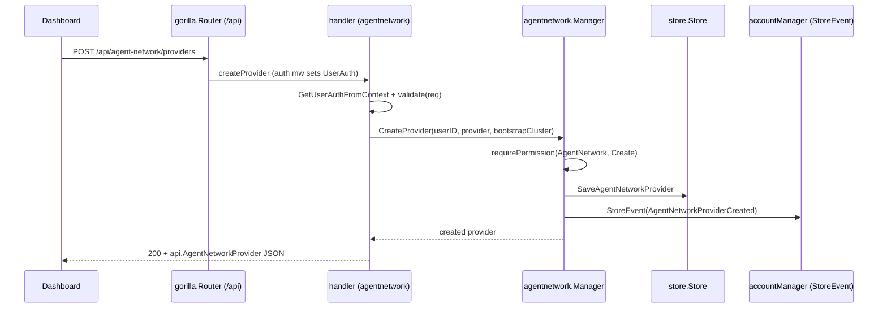

# management/handlers + wiring — HTTP API + gRPC delivery

> **Reviewer profile:** Management infra maintainer; comfortable with gorilla/mux REST handlers, the existing permissions/operations RBAC, the network_map controller fan-out, gRPC server-side streaming, and the reverse-proxy snapshot/live-update path.
> **Time to review:** 60 minutes.
> **Risk level:** Medium — surface is mostly additive, but two changes are load-bearing: `injectAllProxyPolicies` runs on every per-peer compute, and `shallowCloneMapping` now must round-trip `Private` (a missed field silently breaks every MODIFIED).
> **Backward-compat impact:** Additive on the wire (new routes, new RPCs, new proto fields, new gorm column on `AccessLogEntry`). One management-internal break: `nbhttp.NewAPIHandler` gains a trailing `agentNetworkManager` parameter; `nil` is tolerated and silently skips route registration.

## Module boundary

This module is the seam between the public Agent Network HTTP API and the proxy fleet that serves agent traffic. North side: a `/api/agent-network/*` surface (providers, policies, guardrails, budget rules, settings, consumption) on the existing gorilla router, delegating to `agentnetwork.Manager`. Handlers are thin — they translate `api.*` ↔ `types.*`, validate shape, forward. RBAC and event emission stay inside the manager (`manager.go:680-682`).

South side: `ProxyServiceServer` (`proxy.go`) learns to (a) ship synth services to a proxy on initial snapshot, (b) resolve agent-network domains in `getServiceByDomain` for OIDC/session/tunnel-peer flows, (c) gate LLM requests via `CheckLLMPolicyLimits` + `RecordLLMUsage`, (d) preserve `Private` through `shallowCloneMapping` so per-proxy live updates don't silently flip services public. The network_map controller prepends synth services to `account.Services` on every per-peer compute; `accesslogentry.go` gains an indexed `AgentNetwork` column so the dashboard can filter cheaply.

## Commits in scope

| SHA | Subject | LOC delta |
| --- | ------- | --------- |
| 09e8059b6 | AN-2b: wire synth into network map | controller.go +20 / repository.go +10 |
| 9ecb6449d | AN-3: HTTP API handlers + routes | handlers/*, handler.go, module.go, codes.go |
| 9a154714  | AN-6: access-log `agent_network` flag e2e | accesslogentry.go +5 |
| 8cb9c187d | AN-7: enforcement + synth delivery | proxy.go +185, boot.go +24, service.go +109 |
| 263dabd73 | preserve `Private` in clone | proxy.go +1, proxy_clone_test.go +59 |
| 468875cb4 | wire `EnableLogCollection` suppression | service.go (DisableAccessLog plumbing) |
| 23bdf6871 | GC-4: budget-rule + settings HTTP API | budget_handler.go +172, budget_handler_test.go +127 |

## Files changed

| Path | Status | LOC | Role |
| ---- | ------ | --- | ---- |
| `handlers/agentnetwork/providers_handler.go` | new | 216 | Catalog + provider CRUD + central `AddEndpoints` |
| `handlers/agentnetwork/policies_handler.go` | new | 228 | Policy CRUD + shared `validatePolicy*` |
| `handlers/agentnetwork/guardrails_handler.go` | new | 171 | Guardrail CRUD |
| `handlers/agentnetwork/budget_handler.go` | new | 172 | Account-level budget rule CRUD |
| `handlers/agentnetwork/settings_handler.go` | new | 74 | GET (200+`null` if unbootstrapped) + PUT toggles |
| `handlers/agentnetwork/consumption_handler.go` | new | 53 | Read-only consumption rows |
| `handlers/agentnetwork/handlers_test.go` | new | 239 | Real-store fixture; wire round-trip + validation |
| `handlers/agentnetwork/budget_handler_test.go` | new | 127 | Budget-rule + settings toggles |
| `server/http/handler.go` | edit | +7 | New `agentNetworkManager` arg; conditional `AddEndpoints` |
| `server/permissions/modules/module.go` | edit | +2 | New `AgentNetwork` module key |
| `internals/server/boot.go` | edit | +24 | Wires synthesiser adapter + limits service into proxy server |
| `internals/server/modules.go` | edit | +12 | `AgentNetworkManager()` lazy-create node |
| `internals/controllers/network_map/controller/controller.go` | edit | +20/-4 | `injectAllProxyPolicies` replaces 4 `InjectProxyPolicies` calls |
| `internals/controllers/network_map/controller/repository.go` | edit | +10 | `SynthesizeAgentNetworkServices` repo method |
| `internals/modules/reverseproxy/service/service.go` | edit | +109 | `MiddlewareConfig`, capture limits, `AgentNetwork`, `DisableAccessLog` + proto |
| `internals/modules/reverseproxy/accesslogs/accesslogentry.go` | edit | +5 | Indexed `AgentNetwork bool` from proto |
| `internals/shared/grpc/proxy.go` | edit | +185 | Synth wiring, 2 RPCs, domain fallback, `Private` in clone |
| `internals/shared/grpc/proxy_clone_test.go` | new | 59 | Locks every `ProxyMapping` field minus `AuthToken` |
| `server/activity/codes.go` | edit | +49 | 13 new activity codes (125-137) |

## HTTP routes added

All routes inherit the platform's auth middleware. Perms enforced inside `agentnetwork.Manager.requirePermission` (`manager.go:680-682`) on `modules.AgentNetwork`. Permission column shows the `op` passed to `requirePermission` — read = `Read`, etc.

| Method | Path | Perm | Handler |
| ------ | ---- | ---- | ------- |
| GET    | `/agent-network/catalog/providers` | authn only | `providers_handler.go:43` |
| GET    | `/agent-network/providers` | read | `providers_handler.go:57` |
| POST   | `/agent-network/providers` | create | `providers_handler.go:97` |
| GET    | `/agent-network/providers/{providerId}` | read | `providers_handler.go:77` |
| PUT    | `/agent-network/providers/{providerId}` | update | `providers_handler.go:132` |
| DELETE | `/agent-network/providers/{providerId}` | delete | `providers_handler.go:172` |
| GET    | `/agent-network/policies` | read | `policies_handler.go:32` |
| POST   | `/agent-network/policies` | create | `policies_handler.go:72` |
| GET    | `/agent-network/policies/{policyId}` | read | `policies_handler.go:52` |
| PUT    | `/agent-network/policies/{policyId}` | update | `policies_handler.go:102` |
| DELETE | `/agent-network/policies/{policyId}` | delete | `policies_handler.go:142` |
| GET    | `/agent-network/guardrails` | read | `guardrails_handler.go:25` |
| POST   | `/agent-network/guardrails` | create | `guardrails_handler.go:65` |
| GET    | `/agent-network/guardrails/{guardrailId}` | read | `guardrails_handler.go:45` |
| PUT    | `/agent-network/guardrails/{guardrailId}` | update | `guardrails_handler.go:95` |
| DELETE | `/agent-network/guardrails/{guardrailId}` | delete | `guardrails_handler.go:135` |
| GET    | `/agent-network/budget-rules` | read | `budget_handler.go:24` |
| POST   | `/agent-network/budget-rules` | create | `budget_handler.go:64` |
| GET    | `/agent-network/budget-rules/{ruleId}` | read | `budget_handler.go:44` |
| PUT    | `/agent-network/budget-rules/{ruleId}` | update | `budget_handler.go:95` |
| DELETE | `/agent-network/budget-rules/{ruleId}` | delete | `budget_handler.go:135` |
| GET    | `/agent-network/settings` | read | `settings_handler.go:53` (200+`null` if no row) |
| PUT    | `/agent-network/settings` | update | `settings_handler.go:27` |
| GET    | `/agent-network/consumption` | read | `consumption_handler.go:21` |

## gRPC RPCs added (or modified)

| RPC | Direction | Trigger |
| --- | --------- | ------- |
| `CheckLLMPolicyLimits` | proxy→mgmt unary | Pre-flight gate; returns allow/deny, selected policy, attribution group, window, deny code+reason (`proxy.go:259-301`). `Unimplemented` when limits service is nil. |
| `RecordLLMUsage` | proxy→mgmt unary | Post-flight write of tokens+cost against policy-window dimensions + every applicable account budget rule (`proxy.go:303-349`). `window_seconds==0` ⇒ no policy cap, only account fan-out runs. |
| `GetMappingUpdate`/`SendServiceUpdate` (stream) | mgmt→proxy | Snapshot (`proxy.go:752-780`) now appends `SynthesizeServicesForCluster`. Live updates use `SendServiceUpdateToCluster` + `shallowCloneMapping`. |

## Architecture & flow

### HTTP request lifecycle



### Synth-service delivery via gRPC

```mermaid
sequenceDiagram
    participant P as Proxy
    participant G as ProxyServiceServer
    participant SM as service.Manager (persisted)
    participant SA as synthesizerAdapter
    participant AN as SynthesizeServicesForCluster
    participant ST as store.Store

    Note over P,G: Initial snapshot
    P->>G: GetMappingUpdate (stream open)
    G->>SM: GetServicesForCluster(conn.address)
    SM-->>G: persisted []*Service
    G->>SA: SynthesizeServicesForCluster(conn.address)
    SA->>AN: SynthesizeServicesForCluster(store, clusterAddr)
    AN->>ST: walk every account; read providers/policies/settings
    AN-->>SA: in-memory []*Service
    SA-->>G: []*Service
    G->>P: response (persisted + synth)

    Note over G,P: Per-request live update
    G->>G: SendServiceUpdateToCluster(update, clusterAddr)
    G->>G: shallowCloneMapping(update)   %% Private MUST survive
    G->>P: response with single mapping
```

End-to-end: HTTP write persists rows and emits an activity event; the manager then triggers `proxyController.SendServiceUpdate` so proxies re-render. **The snapshot path is the only one that calls into the synthesiser** — on stream open it pulls persisted services then appends synth services for the cluster. Synth services are never persisted. For OIDC/session/tunnel-peer flows, `getServiceByDomain` falls back to `SynthesizeServicesForCluster(clusterFromDomain(domain))` when persisted lookup misses (`proxy.go:1763-1793`). The network_map contribution is orthogonal: per-peer compute prepends the same synth services to `account.Services` before `InjectProxyPolicies`.

## Permissions model added

- `permissions/modules/module.go:22` adds `AgentNetwork Module = "agent_network"`, registered in `All` (`module.go:42`). Standard `operations.{Read,Create,Update,Delete}` matrix.
- Handlers don't call `permissionsManager` directly — they extract `UserAuth` and delegate to `agentnetwork.Manager`, which gates every mutation through `requirePermission` (`manager.go:168, 308, 549`, etc.). Confirm your role-set provider has `agent_network` rows for owner/admin/user/billing-admin before merging.
- `getCatalogProviders` (`providers_handler.go:43`) intentionally skips RBAC — catalog is global static data.

## Activity codes added

`activity/codes.go:244-274` adds Activities 125-137 + string/code mappings (`codes.go:428-444`), following `<domain>.<resource>.<action>` (e.g., `agent_network.provider.create`). Audit-log exporters / SIEM forwarders need to know the new codes.

## Invariants

- **Synth services are never persisted.** Snapshot appends after `serviceManager.GetServicesForCluster` (`proxy.go:761-770`); network_map prepends before `InjectProxyPolicies` (`controller.go:117-126`).
- **`shallowCloneMapping` must round-trip every `ProxyMapping` field except `AuthToken`** — `proxy_clone_test.go:50-58` enforces via `gproto.Equal`. The bug it guards (commit 263dabd73): missing `Private` made every MODIFIED arrive `private=false`, proxy skipped `ValidateTunnelPeer`, `UserGroups` stayed empty, llm_router denied `no_authorised_provider`; restart "fixed" because snapshot uses the original mapping.
- **Limit-window floor is 60s** (`policies_handler.go:189-220`); enabled cap with both per-group and per-user at zero is rejected. Budget rules reuse the same validator (`budget_handler.go:170`).
- **Manager is optional at boot.** `NewAPIHandler` registers routes only when non-nil (`handler.go:129`); `ProxyServiceServer` returns `Unimplemented` from both RPCs when limits service is unwired (`proxy.go:262-265, 306-309`).
- **Settings GET on an unbootstrapped account returns 200 + `null`** (`settings_handler.go:65-72`) — not 404.

## Things to scrutinize

### Correctness
- **`injectAllProxyPolicies` runs on every per-peer compute**: `controller.go:163, 309, 415, 681`. `sendUpdateAccountPeers` is the target of the buffered fan-out — synth runs once per debounced account-update tick **and** once per direct `UpdateAccountPeer`. Cost is O(providers + policies × users-per-group) per account under `LockingStrengthNone`. No per-account synth cache — verify it fits the buffer interval for your largest tenant.
- **`clusterFromDomain` strips at the first `.`** (`proxy.go:1784-1792`). A zero-dot domain returns `""` and the synth call walks every account. Confirm no path reaches this with a malformed/internal domain.
- **Account-budget `RecordConsumption` fans out even when `window_seconds == 0`** (`proxy.go:341-348`) — intentional. Verify the proxy never sends `RecordLLMUsage` for a request that wasn't actually allowed.

### Security
- Every handler extracts `UserAuth` via `nbcontext.GetUserAuthFromContext` before any work. Routes live behind the standard `/api` mux; bypass list is not extended.
- `CheckLLMPolicyLimits` / `RecordLLMUsage` ride the existing **proxy → mgmt** gRPC connection auth. No additional token check inside the RPCs — they trust the connection. Confirm the proxy-side token-verification interceptor in this package gates both.
- `RecordLLMUsage` only validates `account_id != ""` (`proxy.go:317-319`). A compromised proxy can attribute cost to any account in its cluster — was already true for prior RPCs but is louder now that data drives denials.

### Concurrency
- `SetAgentNetworkSynthesizer` / `SetAgentNetworkLimitsService` write under `s.mu.Lock`; read paths copy the interface under read lock (`proxy.go:236-247, 260-263, 304-307`). Same pattern as existing `serviceManager`/`proxyController` setters.
- Manager writes use `LockingStrengthUpdate`; synth reads use `LockingStrengthNone` — read-after-write via the proxy snapshot can observe a stale view by up to one fan-out tick.
- Network_map controller is single-threaded per account; cross-account is parallel.

### Backward compatibility
- `proxy_clone_test.go` is the regression net; any new `ProxyMapping` field must be cloned or explicitly nulled in the test.
- `AccessLogEntry` adds indexed `AgentNetwork bool` — implicit AutoMigrate; deploy story must handle table-rewrite cost on high-volume access-log tables.
- `TargetOptions` gains seven `omitempty` JSON fields (`service.go:69-94`); on-wire shape stays compatible. `targetOptionsToProto` tests all fields when deciding nil (`service.go:551-556`).
- `NewAPIHandler` signature changes — every caller must pass `agentNetworkManager`; `nil` is supported.

### Observability
- 13 new activity codes via `accountManager.StoreEvent` in the manager — confirm dashboard's audit-log UI maps them.
- `AccessLogEntry.AgentNetwork` is indexed for the dashboard's agent-network log filter.
- New RPCs log at error level on store/selector failures (`proxy.go:284, 327, 332, 348`). Snapshot synth failures degrade to warnings — stream is not aborted (`proxy.go:765`).

## Test coverage

| Test | Locks down |
| ---- | ---------- |
| `handlers_test.go::TestPolicyHandler_WindowSecondsRoundTrip` | GET carries `window_seconds`; legacy `window_hours`/`window_days` absent. |
| `handlers_test.go::TestPolicyHandler_RejectsSubMinuteWindow` | POST `<60s` returns 4xx. |
| `handlers_test.go::TestConsumptionHandler_EmptyAccountReturnsArray` | `/consumption` returns `[]` — never null. |
| `handlers_test.go::TestConsumptionHandler_PopulatedAccountListsRows` | RecordConsumption×2 surfaces both with correct tokens/cost/window. |
| `budget_handler_test.go::TestBudgetRuleHandler_RoundTrip` | Targets + PolicyLimits shape round-trip. |
| `budget_handler_test.go::TestBudgetRuleHandler_ListReturnsArray` | Empty-list shape. |
| `budget_handler_test.go::TestBudgetRuleHandler_{RejectsMissingName,RejectsSubMinuteWindow}` | Validation rejections are 4xx. |
| `budget_handler_test.go::TestSettingsHandler_GetExposesCollectionToggles` | All four toggles + computed `Endpoint`. |
| `proxy_clone_test.go::TestShallowCloneMapping_PreservesAllFieldsExceptAuthToken` | Future-proofs clone; every field round-trips, `AuthToken` dropped. |

Handler tests use a real sqlite store + real manager + always-allow permissions mock (`handlers_test.go:53-75`). Create/update/delete success paths flow through `accountManager.StoreEvent` which the fixture doesn't wire — covered by manager-level no-mock tests outside this module.

## Known limitations / explicit non-goals

- No pagination on any list endpoint; no bulk endpoints.
- Synth result is not cached — every snapshot and every per-peer compute repeats the store walk.
- `getSettings` returning `200 + null` is a deliberate dashboard concession.
- No rate-limiting beyond the global `/api` rate limiter.

## Cross-references

- Upstream: [shared/api](10-shared-api.md), [management/agentnetwork](21-management-agentnetwork.md), [management/store](20-management-store.md)
- Downstream: [proxy/runtime](33-proxy-runtime.md)
- End-to-end flow: [../01-end-to-end-flows.md](../01-end-to-end-flows.md)
- Top-level: [../00-overview.md](../00-overview.md)
