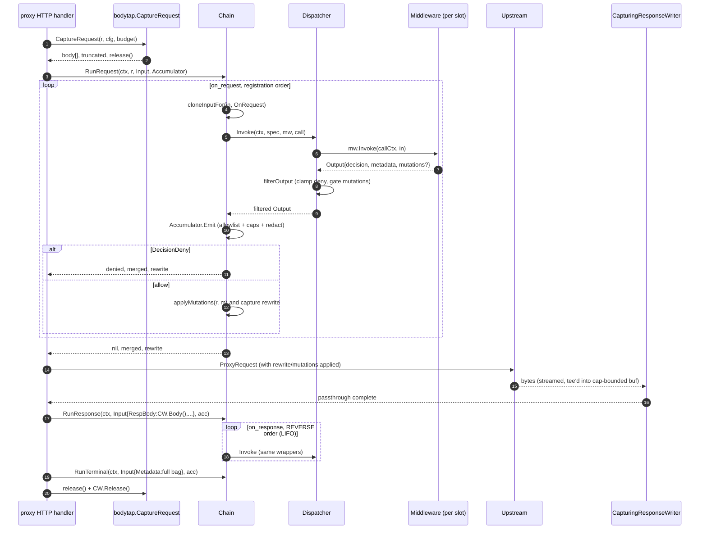

# proxy/middleware-framework — generic plugin system

> **Risk level:** **High** — every proxied request transits this chain. Budget exhaustion, panic recovery, or chain-close bugs hit the hot path for all targets, not just agent-network ones.
> **Backward-compat impact:** Additive at the proxy. The `middleware` and `bodytap` packages are new (`proxy/internal/middleware/middleware.go:1`, `proxy/internal/middleware/bodytap/request.go:13`); existing proxy targets keep working until a chain is bound to them via `Manager.Rebuild`.

This module is the **framework only** — no LLM/agent-network domain knowledge is required, since every example built into it is generic.

## Module boundary

This module is the **framework only**: slots, chains, registry, dispatcher, accumulator, body-tap, output filters. No middleware *implementation* lives here — those land in `proxy/internal/middleware/builtin/*` (covered in module 31). The package contract is:

1. The proxy hands a `Manager` to its config-apply path. The synth pushes per-path `PathTargetBinding` lists (`proxy/internal/middleware/manager.go:26`) into `Manager.Rebuild`, which resolves each spec via the `Registry`/`Resolver` (`proxy/internal/middleware/registry.go:81-121`) and produces an immutable `Chain` keyed by `serviceID|pathID` (`proxy/internal/middleware/manager.go:410-412`).
2. The reverse-proxy handler captures the request body via `bodytap.CaptureRequest`, calls `Chain.RunRequest`, applies returned mutations (already filtered by `chain.applyMutations`), forwards to the upstream behind a `bodytap.CapturingResponseWriter`, then calls `Chain.RunResponse` and `Chain.RunTerminal`.
3. Middlewares are inert plugins that receive a deep-cloned `Input` and return an `Output` whose decision/mutations are clamped by the dispatcher's `filterOutput` (`proxy/internal/middleware/dispatcher.go:149-172`).

Everything that crosses the framework boundary in either direction is value-typed and deep-copied — middlewares cannot mutate the live request directly, and the framework cannot inadvertently leak middleware-owned slices into the request hot path.

## Files

| Path | Role |
| ---- | ---- |
| `proxy/internal/middleware/middleware.go` | `Middleware` + `Factory` interfaces. |
| `proxy/internal/middleware/types.go` | `Slot`, `FailMode`, `Decision`, all limit constants, `Input`/`Output`/`Mutations`/`UpstreamRewrite`/`AuthHeader` value types. |
| `proxy/internal/middleware/spec.go` | Apply-time `Spec` (validated wire shape + runtime-injected fields) and `Clone`. |
| `proxy/internal/middleware/registry.go` | `Registry` (factory map, RWMutex) and `Resolver` (Spec → bound `Middleware`). |
| `proxy/internal/middleware/manager.go` | `Manager`, `chainTable` reverse index, `Rebuild`/`Invalidate*`, async chain close. |
| `proxy/internal/middleware/chain.go` | `Chain.RunRequest`/`RunResponse`/`RunTerminal`, mutation gating, `cloneInputFor`. |
| `proxy/internal/middleware/chain_test.go` | Metadata threading, LIFO response order, rewrite gating, UserGroups propagation, terminal accumulation. |
| `proxy/internal/middleware/dispatcher.go` | Timeout/panic recovery, fail-mode, error classification, `filterOutput`. |
| `proxy/internal/middleware/decision.go` | `RenderDenyResponse`, deny-code regex, status clamp. |
| `proxy/internal/middleware/headerpolicy.go` | Compile-in header denylist + `FilterHeaderMutations`. |
| `proxy/internal/middleware/bodypolicy.go` | `ValidateBodyReplace` / `ApplyBodyReplace` smuggling guards. |
| `proxy/internal/middleware/keys.go` | Metadata key namespace constants. |
| `proxy/internal/middleware/metadata.go` | `Accumulator` — allowlist, per-mw/per-request byte caps, redaction. |
| `proxy/internal/middleware/metrics.go` | OTel instrument bundle (`proxy.middleware.*`). |
| `proxy/internal/middleware/redaction.go` | `Scan` — PEM/JWT/AWS/bearer/Luhn-validated CC patterns. |
| `proxy/internal/middleware/bodytap/request.go` | Capture + replay reader, `Budget` semaphore, bypass reason codes. |
| `proxy/internal/middleware/bodytap/response.go` | `CapturingResponseWriter` (tee with `PassthroughWriter` for Flusher/Hijacker preservation). |

## Slot model

Three slots, declared per-middleware exactly once (`proxy/internal/middleware/types.go:27-41`):

- **`SlotOnRequest`** (`Slot=1`) — runs **before** the upstream call, in registration order. May `DecisionDeny`, may emit `Mutations` (header add/remove, body replace, `UpstreamRewrite`) when both `Spec.CanMutate` and `Middleware.MutationsSupported()` are true. May emit metadata. Each middleware in the slot sees metadata that earlier ones in the same slot just emitted (`proxy/internal/middleware/chain.go:144-178`) — this is how the framework gives middlewares an intra-slot side channel without a global bag.
- **`SlotOnResponse`** (`Slot=2`) — runs **after** the upstream returns, in **reverse** registration order. Cannot deny (clamped in `dispatcher.filterOutput`, `proxy/internal/middleware/dispatcher.go:153-157`). May still mutate response headers in principle, but the current chain only forwards `RewriteUpstream` from on_request, so on_response mutations are observe-only in practice. Threads the same per-slot metadata view as on_request.
- **`SlotTerminal`** (`Slot=3`) — runs **after** every on_response middleware has emitted, in registration order. Sees the full accumulated bag plus prior terminal emissions (`chain.go:221-245`). Cannot deny, cannot mutate (`dispatcher.go:168-170`). Designed for sinks (access log, metrics push, audit emitter).

Splitting a feature across slots (e.g. "parse on the way out, ship on terminal") is the explicit architectural choice — `types.go:7-15` and `types.go:22-25` make it clear no middleware participates in more than one slot.

## Architecture & flow

### Chain dispatch



### Body-tap mechanics (request + response)

```mermaid
flowchart LR
    subgraph req[Request capture — bodytap.CaptureRequest]
        R0[r.Body] --> R1{cfg.MaxRequestBytes > 0?\nUpgrade absent?\nContent-Type allowed?\nCL <= cap?}
        R1 -- no --> R2[bypass = reason\nbody = nil\nr.Body untouched]
        R1 -- yes --> R3[Budget.Acquire(cap)]
        R3 -- denied --> R4[bypass=BypassBudget]
        R3 -- ok --> R5[io.LimitReader(r.Body, cap+1)\nio.ReadAll]
        R5 --> R6{len > cap?}
        R6 -- truncated --> R7[viewable = buf[:cap]\nr.Body = replayReadCloser{buf, tail}]
        R6 -- whole --> R8[r.Body = NopCloser(bytes.Reader(buf))\nclose original]
        R7 --> R9[(release captured\nbudget on req end)]
        R8 --> R9
    end

    subgraph resp[Response capture — CapturingResponseWriter]
        W0[client] -.-> CW[Write(p)]
        CW --> P1[PassthroughWriter.Write(p)\n— bytes leave to client first]
        P1 --> P2{!stopped?}
        P2 -- yes --> P3{remaining = cap - buf.Len()}
        P3 --> P4[buf.Write(p[:take])\nset truncated if take<n]
        P2 -- no --> P5[silent drop into the tee\n(client write already done)]
    end
```

The body-tap is the highest-leak-risk surface in this module; three details matter:

1. **Request capture is "read-and-replay", not "read-and-forward".** `CaptureRequest` always swaps `r.Body` for either a `bytes.Reader` (whole body fit) or a `replayReadCloser` that replays the captured prefix then drains the remaining stream from the original body (`bodytap/request.go:178-201`). This means the **upstream still sees the full body even when the tap truncates**. The original `r.Body` is **not** closed in the truncated branch — `replayReadCloser.Close()` only closes the tail (`bodytap/request.go:199-201`), which is the same reader, so close once on request end is correct, but reviewers should confirm the upstream proxy always reads to EOF (otherwise the tail is leaked).
2. **Response capture is a write-through tee.** `CapturingResponseWriter.Write` forwards to the underlying writer **first** (`bodytap/response.go:116-117`), then tees into `buf` under its own mutex. Client never blocks on the tee. `Flusher`/`Hijacker` are preserved via the embedded `responsewriter.PassthroughWriter`. SSE/chunked streams flow through untouched; middlewares only see the bounded prefix.
3. **Budget is a single shared semaphore.** `Manager` constructs one `bodytap.Budget` at startup (`manager.go:138-144`, default `256 MiB` from `bodytap/request.go:39`). Every capture pre-acquires its full `MaxRequestBytes` / `MaxResponseBytes` from the budget regardless of actual body size; that prevents a flood of small captures from collectively exceeding the cap, but it also means a misconfigured `MaxRequestBytes = 1 MiB` with 256 concurrent requests already exhausts the default budget. Reviewers should sanity-check the operator-facing defaults that ship with synth-service.

The framework explicitly aborts capture (and increments `proxy.middleware.capture_bypass_total`) before reading the first byte when `Upgrade`/`Connection: upgrade` is set (`bodytap/request.go:120-125`), when the content-type isn't in the allowlist (`bodytap/request.go:126-128`), or when the advertised `Content-Length` already exceeds the cap (`bodytap/request.go:131-133`). This is the right place to make sure WebSocket upgrades and large file uploads never reach the buffer.

## Public contracts

- **`Middleware` interface** (`middleware.go:14-36`): `ID()`, `Version()`, `Slot()`, `AcceptedContentTypes()`, `MetadataKeys()`, `MutationsSupported()`, `Invoke(ctx, *Input) (*Output, error)`, `Close()`. `MetadataKeys()` is the **closed set** the middleware is allowed to emit — the accumulator drops anything outside it (`metadata.go:71-75`). `Close` must be idempotent (called even when `Invoke` was never reached).
- **`Factory` interface** (`middleware.go:44-47`): `ID()`, `New(rawConfig []byte) (Middleware, error)`. `RawConfig` is opaque JSON bytes on the wire (`spec.go:6-12`); each factory owns its own typed config.
- **`Decision` type** (`types.go:59-69`): `Allow=0`, `Deny=1`, `Passthrough=2`. Default-zero is permissive — important because every middleware that omits `Decision` gets `Allow`. Dispatcher clamps `Deny` to `Passthrough` outside `SlotOnRequest` (`dispatcher.go:153-157`).
- **`Mutations`** (`types.go:196-201`): `HeadersAdd`/`HeadersRemove` (filtered through `headerpolicy.go`), `BodyReplace` (gated through `bodypolicy.go`), and `RewriteUpstream`. `RewriteUpstream` is **last-write-wins** within the on_request slot (`chain.go:170-172`, locked down by `TestChain_RunRequest_LatestRewriteWins`).
- **Metadata propagation keys** (`keys.go`): all keys live in a single file and follow `^[a-z][a-z0-9_-]*(\.[a-z0-9_-]*)+$` (`metadata.go:8`). Framework-injected error tagging uses `mw.<id>.error_kind` (`keys.go:81`) so operators can distinguish framework-emitted entries from middleware-emitted ones.

## Invariants

- **Per-request context isolation.** `cloneInputFor` deep-copies every mutable field (`Headers`, `RespHeaders`, `Metadata`, `Body`, `RespBody`, `UserGroups`, `UserGroupNames`) before each invocation (`chain.go:286-308`). A misbehaving middleware that mutates `in.Headers` only corrupts its own copy.
- **Body-tap bounded by capture limit.** Request side uses `io.LimitReader(r.Body, limit+1)` (`bodytap/request.go:152`) — the `+1` is how the code detects truncation (`bodytap/request.go:160`); the surfaced buffer is sliced back down to `limit`. Response side stops teeing once `buf.Len() >= cap` (`bodytap/response.go:121-133`). Neither side can grow the buffer past the configured cap.
- **Headers/body redaction order.** Accumulator runs `Scan(value)` **before** counting cost (`metadata.go:81-82`), so the byte budgets are computed against post-redaction sizes. `Scan` order is PEM → JWT → AWS key → bearer → Luhn-validated CC (`redaction.go:25-51`) — the comment block in `redaction.go:8-13` is explicit that this is best-effort, not DLP.
- **No middleware can starve the chain.** Every invocation runs inside `context.WithTimeout(ctx, clampTimeout(spec.Timeout))` in a separate goroutine (`dispatcher.go:51-94`), with the deadline race-`select`ed against the result channel. A blocked middleware fires the timeout path, gets fail-mode'd, and `IncError(kind=timeout)`. Timeouts are clamped to `[10ms, 5s]` (`types.go:80-86`, `dispatcher.go:174-185`).
- **Panic recovery.** `recover()` captures the panic, logs only the type + a 4 KiB stack prefix (no panic value — avoids leaking secrets the middleware was processing), and produces a `panicError` that flows through fail-mode (`dispatcher.go:64-76`).
- **Chain immutability + atomic swap.** `chainTable` is cloned on every `Rebuild`/`Invalidate*` and swapped via `atomic.Pointer` (`manager.go:44-69`, `manager.go:221-300`). Readers (`ChainFor`) are lock-free; writers serialise on `writeMu`. The retired chain is `Close`-d in a background goroutine bounded by `chainCloseTimeout = 2 * MaxTimeout` (`manager.go:21-22`, `manager.go:326-346`), so in-flight invocations finish on the old chain after the swap.

## Things to scrutinize

### Correctness

- **Chain ordering deterministic from synth output?** `Manager.buildChain` iterates `b.Specs` in slice order and appends to `bound` (`manager.go:366-391`); `NewChain` then partitions by slot but **preserves slice order within each slot** (`chain.go:50-60`). So order on the wire = order observed at runtime. Synth must therefore emit specs in the intended execution order — there is no per-spec `Priority` field. Worth flagging.
- **Decision short-circuit semantics.** `RunRequest` returns immediately on `DecisionDeny` (`chain.go:164-167`) **with the metadata accumulated so far** plus the `denied.Metadata`. Callers that ignore `merged` on deny will lose framework-injected `mw.<id>.error_kind` entries. The proxy runtime is the only caller; confirm it always feeds `merged` into the access log on the deny path as well.
- **`UpstreamRewrite` `AuthHeader` bypass** (`types.go:218-235`). The `AuthHeader`/`StripHeaders` fields *intentionally* bypass the header denylist on the basis that the proxy itself rewrites auth. The denylist still blocks middleware-emitted `HeadersAdd: Authorization=...`. This is a delicate carve-out — review the runtime consumer to confirm only the trusted upstream-build path unpacks `AuthHeader`, never the generic `applyMutations` loop.
- **`replayReadCloser.Close` only closes the tail** (`bodytap/request.go:199-201`). The replay buffer doesn't own a resource, so this is correct, but it conflates "replay finished" with "underlying body closed". If a caller `Close()`s without reading to EOF, the original body is closed but the captured prefix is lost; harmless for the proxy path (upstream always reads to EOF) but worth a doc-comment.

### Security

- **Body-tap memory bounds.** Discussed above — bounded by `MaxBodyCapBytes = 1 MiB` per direction (`types.go:77`) and the shared `Budget` (default 256 MiB). The concerning case is the **deep-copy in `cloneInputFor`** (`chain.go:300-306`): every middleware invocation gets its **own copy** of `Body` and `RespBody`. A chain of N middlewares with a 1 MiB body allocates N MiB of transient bytes per request. With `MaxMiddlewaresPerChain = 16` (`types.go:103`) that's up to 16 MiB extra per in-flight request. Worth pricing into the budget model.
- **Header redaction completeness.** `denyHeaders` (`headerpolicy.go:5-17`) covers the auth/forwarding family and framing (`Content-Length`, `Transfer-Encoding`, `Trailer`). `denyHeaderPrefixes` covers `X-Authenticated-*`, `X-Forwarded-*`, `X-Remote-*`, `X-NetBird-*`. Notably absent: `Range`, `If-Match`/`If-None-Match` (mutation could cause cache poisoning), `Origin`/`Referer`. Not necessarily wrong, but worth a deliberate decision.
- **Metadata key collisions across middlewares.** The accumulator has no cross-middleware uniqueness check; two middlewares with the same key in their allowlist can both emit it, and both copies land in `merged` (`metadata.go:51-99`). Downstream consumers must tolerate duplicates. Worth documenting.
- **Deny rendering.** `RenderDenyResponse` only allows codes matching `^[a-z][a-z0-9._-]{0,63}$` (`decision.go:9`), redacts/truncates message + detail values, caps `Details` at 8 entries (`decision.go:42-50`), clamps status to `[400,499]\{401}` (`decision.go:65-73`). The deny body type is fixed; middlewares cannot inject arbitrary JSON.

### Concurrency

- **Per-request state vs shared state in factories.** Each `Factory.New` is called once per chain build; the returned `Middleware` instance is **shared across all requests** for that chain. `Invoke` must be reentrant. The framework does not enforce this — a buggy middleware that holds per-call state on the struct will silently race. Suggest a `// Invoke must be safe for concurrent use` doc on the interface.
- **`chainTable` clone-on-write** is correct, but `addChain`/`removeChain` mutate the *cloned* table before the swap (`manager.go:71-108`), and they're called under `writeMu`. Readers only ever see the post-swap pointer. Good.
- **`Chain.inflight` WaitGroup**. `Run*` does `Add(1)`/`Done()` (`chain.go:142-143`, `chain.go:194-195`, `chain.go:225-226`); `Close` waits on it bounded by ctx (`chain.go:75-85`). One concern: a *new* `RunRequest` can `Add(1)` *after* `Close` started waiting if the caller still holds a stale chain pointer. `WaitGroup` does not panic on this if the count was already > 0 at `Wait` time, but it does panic if `Add` happens after `Wait` returns and another `Wait` runs. `Close` is documented one-shot, so single-`Wait` is fine, but callers must drop the chain reference before calling `Close`. Worth a code comment near `Close`.
- **Goroutine leaks.** `Dispatcher.Invoke` spawns one goroutine per call and *always* writes to a buffered (cap=1) channel (`dispatcher.go:62-76`), so even if the timeout fires the goroutine completes its send and exits. No leak.
- **`closeChainsAsync`** detaches retired chains into a goroutine (`manager.go:326-346`). If `Manager` is never GC'd this is fine, but there's no shutdown hook to wait on outstanding closes. Reviewers should confirm the proxy shutdown path explicitly drains in-flight requests before tearing down `Manager`, or accept that the last chain-close round may be cut short on exit.

### Performance

- **Allocations per request.** `cloneInputFor` allocates new slices for `Headers`, `RespHeaders`, `Metadata`, `Body`, `RespBody`, `UserGroups`, `UserGroupNames` — once per middleware per request. For a typical 5-middleware chain on a 1 KiB body that's ~10 small slice allocs plus one `Body` copy each. Not a hot-path crisis, but `sync.Pool` for the per-call `Input` would be a natural follow-up.
- **Accumulator allocates a fresh `allowSet` per `Emit` call** (`metadata.go:55-58`). One per middleware per slot pass = up to 48 per request. Cheap, but worth noting.
- **Regex cost.** `Scan` runs five regex passes on every accepted metadata value (`redaction.go:25-51`). Bounded by `MaxMetadataValueBytes = 4 KiB` so worst case is small.

### Observability

- **Per-middleware metrics.** `proxy.middleware.requests_total{middleware,target_id,outcome}` (`metrics.go:34-41`), `duration_ms`, `invocations_total`, `errors_total{kind}`, `metadata_rejected_total{reason}`, `header_mutation_blocked_total{header}`, `capture_bypass_total{reason}`. Comprehensive surface; operators can alert on `errors_total` and `errors_total` separately. **Latency histogram is in milliseconds with default OTel buckets** — for a 10ms–5s timeout range default buckets cover OK, but a custom bucket set centred on 1–500ms would resolve the agent-network response-parser tail better.
- **Decision logs.** Panic logs (`dispatcher.go:69`) include `request_id`, type, and stack but not the panic value (safe). `Chain.Close` logs middleware-close errors at debug (`chain.go:91`). `applyMutations` logs body-replace rejections at warn (`chain.go:278`). No log on the deny path itself — by design, since the access-log terminal middleware is expected to record outcomes.

## Test coverage

| Test file | Locks down |
| --------- | ---------- |
| `proxy/internal/middleware/chain_test.go:77` | `RunRequest` threads metadata across on_request middlewares (regression for the "later mw can't see earlier mw's emissions" bug). |
| `chain_test.go:110` | `RunResponse` reverse-order threading. |
| `chain_test.go:142` | `cost_meter`-shaped scenario: response_parser registered after cost_meter still emits *before* cost_meter sees the bag (guards the `cost.skipped=missing_tokens` regression). |
| `chain_test.go:178` | `UpstreamRewrite` last-write-wins. |
| `chain_test.go:206` | No middleware emits → nil rewrite. |
| `chain_test.go:224` | Rewrite filtered when `CanMutate=false`. |
| `chain_test.go:245` | `Input.UserGroups` propagates verbatim through `cloneInputFor`. |
| `chain_test.go:304` | Terminal middlewares see the full accumulated bag + prior terminal emissions. |

**Gaps** worth raising with the author:
- No direct test for `Dispatcher.Invoke` timeout / panic / fail-mode behaviour at the framework level (covered indirectly by built-in tests, but a unit test pinning `errors_total{kind=...}` labels would be cheap insurance).
- No test for `bodytap.CaptureRequest` truncated replay (the upstream-sees-full-body invariant is exactly the kind of thing a regression would silently break).
- No test for `Budget` exhaustion behaviour under concurrency.
- No test for `Manager.InvalidateMiddleware` + `LiveServiceCheck` race (the auth-revocation race the comment at `manager.go:33-38` calls out is the load-bearing reason for `LiveServiceCheck`).

## Known limitations / explicit non-goals

- **No middleware-to-middleware RPC.** Side-channel is metadata only.
- **No streaming body inspection.** Middlewares see a bounded prefix; SSE / chunked parsing happens against that prefix in the response middleware.
- **No per-spec priority.** Order is registration order in the spec slice.
- **No retry / circuit-breaker** on middleware errors. Fail-mode is binary (open/closed) and per-spec.
- **Mutations cannot rewrite the request URL path or query** — only `RewriteUpstream` can change scheme/host (+ optional path replacement, see `types.go:218-235`).
- **Redaction is best-effort.** Explicitly documented in `redaction.go:8-13`. Not a DLP solution.

## Cross-references

- Upstream wire shape: [../modules/10-shared-api.md](10-shared-api.md) (Spec/RawConfig encoding from management).
- Built-in middlewares using this framework: [../modules/31-proxy-middleware-builtin.md](31-proxy-middleware-builtin.md).
- Runtime wiring (where `Manager`, `Chain`, and `bodytap` are consumed by the HTTP handler): [../modules/33-proxy-runtime.md](33-proxy-runtime.md).
- End-to-end request flow including capture + chain dispatch: [../01-end-to-end-flows.md](../01-end-to-end-flows.md).
- Top-level architecture: [../00-overview.md](../00-overview.md).
