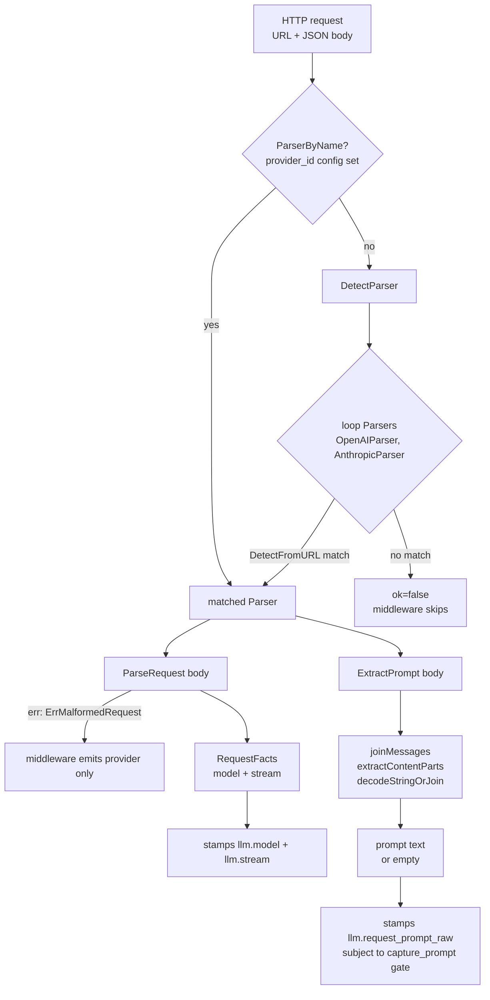
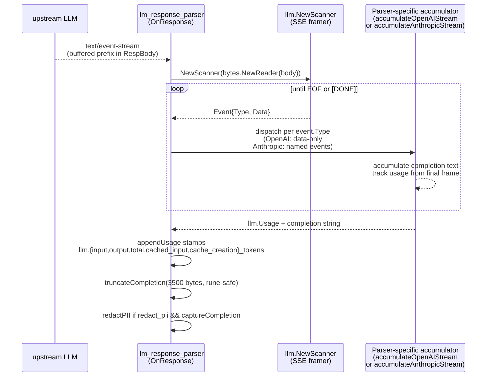

# proxy/llm-parsers — SDK adapters + pricing + SSE

The runtime-agnostic LLM library: the OpenAI Responses API (`/v1/responses`)
and the older Chat Completions API (`/v1/chat/completions`), the Anthropic
Messages API (`/v1/messages`), the SSE wire format (`event:` / `data:` lines,
`\n\n` framing, CRLF tolerance), and per-provider token accounting (OpenAI's
cached-prompt **subset** vs Anthropic's cache_read **additive** model). The
pricing table's per-provider cost formula is the highest-leverage place a
small bug would silently mis-bill operators.

Sibling module: [31-proxy-middleware-builtin.md](./31-proxy-middleware-builtin.md)
— the 8 middlewares that consume this package's parsers + pricing loader.

---

## Module boundary

`proxy/internal/llm` is the runtime-agnostic LLM library shared by every
middleware that needs to understand provider-specific shapes. Zero
proxy-framework dependencies:

- `parser.go` — `Parser` interface, `Provider` enum, public factories
  (`Parsers`, `DetectParser`, `ParserByName`).
- `openai.go` / `anthropic.go` / `bedrock.go` — per-provider `Parser` impls.
- `sse.go` — SSE scanner (`Scanner`, `Event`, `NewScanner`).
- `errors.go` — sentinels callers branch on with `errors.Is`.
- `pricing/` — embedded-default + hot-reload override table with
  symlink-safe Unix loader (build-tagged stub elsewhere).
- `fixtures/` — captured request/response/stream bodies the tests replay.

The package carries zero proxy-framework dependencies so the same parsers can
be reused later by a WASM adapter
([parser.go:1–6](../../../proxy/internal/llm/parser.go)).

## Files

| File | LOC | Notes |
|---|---:|---|
| `parser.go` | 104 | Interface + factories + `Provider{Unknown,OpenAI,Anthropic}` enum |
| `openai.go` | 347 | Chat Completions + Completions + Responses API; cached_tokens subset |
| `openai_test.go` | 222 | 11 tests; fixture replay + cached/Responses-API matrix |
| `anthropic.go` | 172 | Messages + legacy `/v1/complete`; cache_read + cache_creation additive |
| `anthropic_test.go` | 154 | 7 tests including streaming-extraction-skipped contract |
| `bedrock.go` | 190 | AWS Bedrock InvokeModel (snake_case) + Converse (camelCase) response shapes; model lives in URL path |
| `bedrock_test.go` | — | InvokeModel + Converse usage shapes; AWS event-stream content-type → `ErrStreamingUnsupported` on buffered `ParseResponse` |
| `sse.go` | 117 | `bufio`-backed scanner; CRLF normalised; trailing-event handling |
| `sse_test.go` | 175 | 12 tests; fixture replay + multiline + size limits |
| `parser_test.go` | 53 | `Parsers()`, `DetectParser`, provider enum values |
| `errors.go` | 31 | 6 sentinels: `Err{Unknown,Unsupported}Provider/Model`, `Err{NotLLM,Malformed}Response`, `ErrStreamingUnsupported`, `ErrMalformedRequest` |
| `pricing/pricing.go` | 421 | `Loader`, `Table`, `Entry`; embedded defaults + atomic swap + mtime reload |
| `pricing/pricing_unix.go` | 69 | `O_NOFOLLOW` + fstat-from-FD + 1 MiB cap |
| `pricing/pricing_other.go` | 21 | Stub returning "not supported on this platform" |
| `pricing/pricing_test.go` | 432 | 21 tests — symlink rejection, reload race, path traversal, oversize |
| `pricing/defaults_pricing.yaml` | 85 | go:embed source of truth |
| `fixtures/*` | 21–59 | OAI chat/responses/stream + Anthro messages/stream + pricing starter |

## Request body → parser dispatch



OpenAI's URL hints
([openai.go:27–33](../../../proxy/internal/llm/openai.go)) include
both `/v1/chat/completions` and the bare `/chat/completions` — the latter
covers Cloudflare AI Gateway, which rewrites the canonical version segment.
Anthropic's hints are `/v1/messages` and `/v1/complete`
([anthropic.go:14–17](../../../proxy/internal/llm/anthropic.go)).
Both implementations use case-insensitive substring matching so a proxy prefix
strip / rewrite doesn't defeat detection.

`ParserByName` ([parser.go:93–103](../../../proxy/internal/llm/parser.go))
is the **agent-network bypass**: the synthesiser knows which parser to use
because it built the synth service from the catalog, so it stamps
`provider_id` on the parser config and the middleware skips URL sniffing
entirely. This is what makes the same parser set work whether the request
flows to OpenAI direct, to LiteLLM, to Portkey, or to any gateway with a
non-canonical URL shape.

**Path-routed providers (Vertex AI, Bedrock) bypass both `ParserByName` and
`DetectParser`.** The model and the parser surface live in the URL path, so the
request middleware extracts them directly (`parseVertexPath` /
`parseBedrockPath`) before the parser-selection step. For Vertex the publisher
segment picks the parser (`anthropic` → Anthropic parser; `google`/Gemini →
none, request denied as unmeterable). For Bedrock the dedicated `BedrockParser`
handles the response. Full treatment in
[50-path-routed-providers.md](./50-path-routed-providers.md).

## Streaming response → SSE chunker → response parser → completion + token count



`Scanner.Next`
([sse.go:44–87](../../../proxy/internal/llm/sse.go)) returns one
event per `\n\n` boundary; multiple `data:` lines join with `\n`; comment lines
(starting with `:`) are skipped per the SSE spec; a trailing event without a
closing blank line is still returned before `io.EOF` so a server that closes
the connection cleanly doesn't lose the last frame
([sse.go:55–58](../../../proxy/internal/llm/sse.go)). CRLF is
normalised in `trimEOL` so fixtures captured from live servers replay
unchanged.

## Per-provider

### OpenAI

[openai.go:54–67](../../../proxy/internal/llm/openai.go) defines
`openAIRequest` with three prompt fields: `messages` (Chat Completions),
`prompt` (legacy), `input` (Responses API). The decoder uses
`json.RawMessage` so each shape is parsed lazily.

`ParseResponse`
([openai.go:117–146](../../../proxy/internal/llm/openai.go))
accepts both naming conventions: Chat Completions returns
`prompt_tokens`/`completion_tokens`, Responses API returns
`input_tokens`/`output_tokens`. `pickInt64` prefers Responses-API names and
falls back — same parser handles both endpoints without per-route config.
`openAICachedTokens` mirrors the fallback for
`input_tokens_details.cached_tokens` vs `prompt_tokens_details.cached_tokens`.

**Key invariant:** `CachedInputTokens` for OpenAI is a SUBSET of
`InputTokens`. The cost meter clamps to guard against malformed upstream
responses where `cached > total`.

### Anthropic

[anthropic.go:37–49](../../../proxy/internal/llm/anthropic.go)
defines `anthropicRequest` covering Messages API (`system` + `messages[]`)
and legacy `/v1/complete` (`prompt` string). `ExtractPrompt` emits
`system: <text>` first when present, then per-message `role: content`.

`ParseResponse`
([anthropic.go:82–104](../../../proxy/internal/llm/anthropic.go))
fills three independent token buckets: `InputTokens`, `CacheReadInputTokens`,
`CacheCreationInputTokens`. Latter two are **additive** (not subset).
`TotalTokens` sums all four so downstream dashboards render one "tokens"
number without double-counting.

`ExtractCompletion` walks `content[]` `{type, text}` parts and concatenates
non-empty text with newlines, falling back to legacy `completion`.

### Bedrock

[bedrock.go](../../../proxy/internal/llm/bedrock.go) implements the
`Parser` interface for the AWS Bedrock runtime. Bedrock is **path-routed**: the
model lives in the URL (`/model/{id}/{action}`), so the request middleware
extracts it (see [50-path-routed-providers.md](./50-path-routed-providers.md))
and `ParseRequest` is a deliberate no-op. The parser's real work is on the
response leg, covering both Bedrock body shapes:

- **InvokeModel** — vendor-native. Anthropic-on-Bedrock returns snake_case usage
  (`input_tokens`, `output_tokens`, `cache_read_input_tokens`,
  `cache_creation_input_tokens`) with the same additive cache buckets as
  first-party Anthropic.
- **Converse** — unified camelCase (`inputTokens`, `outputTokens`,
  `totalTokens`). `firstNonZero` folds the two naming conventions into one
  `Usage`; when Converse omits `totalTokens` the parser sums the buckets.

`ProviderName()` returns `"bedrock"` — its own `defaults_pricing.yaml` block,
keyed by the **normalised** model id (region prefix + version suffix stripped by
the request parser). `ParseResponse` returns `ErrStreamingUnsupported` for an
AWS binary event-stream content-type (`application/vnd.amazon.eventstream`,
`isAWSEventStream`) so the caller routes to the streaming accumulator instead.

### SSE framing

`Scanner` is `bufio`-backed, 64 KiB read buffer, 1 MiB max line so a
malicious upstream can't blow process memory
([sse.go:33–38, 97–100](../../../proxy/internal/llm/sse.go)).
`splitField` strips one space after the `:` per the SSE spec. Documented
`not safe for concurrent use`; every consumer creates a fresh scanner per
response body. Streaming accumulators live in the middleware package
([llm_response_parser/streaming.go](../../../proxy/internal/middleware/builtin/llm_response_parser/streaming.go))
but use `llm.NewScanner` so the framing contract stays here.

### Pricing catalog

`Table.Cost`
([pricing.go:129–174](../../../proxy/internal/llm/pricing/pricing.go))
is the cost formula — most security-relevant math in this module:

| Provider | Formula |
|---|---|
| `openai` | `(inTokens − clamped) × InputPer1K + clamped × CachedInputPer1K + outTokens × OutputPer1K` where `clamped = min(cachedInput, inTokens)` |
| `anthropic`, `bedrock` | `inTokens × InputPer1K + cachedInput × CacheReadPer1K + cacheCreation × CacheCreationPer1K + outTokens × OutputPer1K` |
| default | `inTokens × InputPer1K + outTokens × OutputPer1K` |

`bedrock` shares the Anthropic additive-cache formula
([pricing.go:172-174](../../../proxy/internal/llm/pricing/pricing.go)):
Anthropic-on-Bedrock reports the same additive cache buckets, while non-Anthropic
Bedrock models (Nova, Llama) simply report zero in those buckets so cost reduces
to `input + output`.

Each per-bucket rate falls back to `InputPer1K` when zero — operators opt in
to discounts by setting the field.

`Loader`
([pricing.go:212–268](../../../proxy/internal/llm/pricing/pricing.go))
overlays an optional `pricing.yaml` from data-dir on top of the go:embed
defaults. Atomic pointer swap means readers never observe a partial update.
The mtime-poll reloader (30s default cadence) keeps the previous table on
parse failure so cost annotation never goes blank during a botched edit.

`defaults_pricing.yaml` is the source of truth for built-in pricing.
Operator overrides only carry the entries they want to change.

## Public contracts

**`Parser` interface**
([parser.go:50–66](../../../proxy/internal/llm/parser.go)):

```go
type Parser interface {
    Provider() Provider
    ProviderName() string
    DetectFromURL(path string) bool
    ParseRequest(body []byte) (RequestFacts, error)
    ParseResponse(status int, contentType string, body []byte) (Usage, error)
    ExtractPrompt(body []byte) string
    ExtractCompletion(status int, contentType string, body []byte) string
}
```

Adding a provider means implementing this interface and appending to the
slice returned by `Parsers()` ([parser.go:78–84](../../../proxy/internal/llm/parser.go)).
Order matters: `DetectFromURL` ties resolve by registration order.
`Parsers()` today returns `{OpenAIParser, AnthropicParser, BedrockParser}`.

**`Provider` enum**
([parser.go:8–18](../../../proxy/internal/llm/parser.go)):
`ProviderUnknown = 0`, `ProviderOpenAI = 1`, `ProviderAnthropic = 2`,
`ProviderBedrock = 3`. Numeric values are persisted in nothing today but treat
them as wire-stable — new providers must take fresh numbers.

**`Pricing` lookup**
([pricing.go:129](../../../proxy/internal/llm/pricing/pricing.go)):

```go
func (t *Table) Cost(provider, model string, inTokens, outTokens, cachedInput, cacheCreation int64) (float64, bool)
```

Nil-safe: `t.Cost` on a nil receiver returns `(0, false)`
([pricing.go:130–132](../../../proxy/internal/llm/pricing/pricing.go)).
`ok=false` means provider or model is absent from the loaded table; the caller
emits `cost.skipped=unknown_model`.

## Invariants

1. **Cross-platform pricing build.** `pricing_unix.go` carries the only
   functional `loadPricing` (uses `syscall.O_NOFOLLOW` and `f.Stat()` on an
   open descriptor — both Unix-only). `pricing_other.go` is a build-tag
   fallback that returns `"not supported on this platform"`
   ([pricing_other.go:14–16](../../../proxy/internal/llm/pricing/pricing_other.go)).
   The proxy is Linux-only in production today; a Windows port needs an
   equivalent path-as-handle implementation. Reviewers building on Windows
   should expect this surface to return an error at startup if an override
   file is configured.

2. **SSE scanner handles partial chunks.** A buffered prefix that doesn't end
   in `\n\n` still yields its accumulated event before `io.EOF`
   ([sse.go:55–58](../../../proxy/internal/llm/sse.go)). Tests:
   `TestSSEScanner_OpenAIFixture`, `TestSSEScanner_AnthropicFixture`,
   `TestSSEScanner_MultilineData`, `TestSSEScanner_CRLF`. The streaming
   accumulators ride on this: `accumulateAnthropicStream` and
   `accumulateOpenAIStream` `break` on any scanner error to return partial
   usage rather than aborting
   ([streaming.go:68–73, 144–150](../../../proxy/internal/middleware/builtin/llm_response_parser/streaming.go)).

3. **`defaults_pricing.yaml` is the source of truth.** Compiled into the
   binary via `//go:embed`
   ([pricing.go:29–30](../../../proxy/internal/llm/pricing/pricing.go)).
   `DefaultTable()` parses once and panics on parse failure
   ([pricing.go:42–49](../../../proxy/internal/llm/pricing/pricing.go))
   — by design: a broken embedded YAML must not ship to production.

4. **Loader path validation.** `resolveMiddlewareDataPath`
   ([pricing.go:370–394](../../../proxy/internal/llm/pricing/pricing.go))
   rejects absolute paths, traversal segments, and basenames that fail
   `basenameRegex = ^[a-zA-Z0-9._-]+$`. The resolved path must remain
   inside `baseDir` even after `filepath.Clean`. Tests:
   `TestNewLoader_PathValidation`, `TestNewLoader_PathValidation_Extended`,
   `TestNewLoader_SymlinkOutsideBaseDirRejected`, `TestNewLoader_SymlinkRejected`.

5. **Unix loader symlink safety.** `O_NOFOLLOW` on open, `f.Stat()` on the
   open descriptor (never re-stat by path), `info.Mode().IsRegular()` check,
   `io.LimitReader(f, maxPricingBytes+1)` with a final size assertion
   ([pricing_unix.go:25–57](../../../proxy/internal/llm/pricing/pricing_unix.go)).
   A mid-read symlink swap is detected because the fstat is on the original
   fd. Test: `TestNewLoader_RejectsOversizedFile_FixesM4`.

6. **`yaml.NewDecoder(...).KnownFields(true)`**
   ([pricing.go:397–398](../../../proxy/internal/llm/pricing/pricing.go))
   rejects YAML files that carry fields not in the schema. A typo in an
   operator override file fails loud instead of silently zeroing rates.

## Things to scrutinise

**Correctness.** Verify OpenAI cached-prompt clamp at
[pricing.go:147–149](../../../proxy/internal/llm/pricing/pricing.go)
short-circuits before subtraction. `Anthropic.TotalTokens` sums all four
buckets (in + out + cache_read + cache_creation) — downstream dashboards
need to know this differs from `input + output`.
`OpenAIParser.ExtractPrompt` falls through `messages → input → prompt`; a
request sending all three reports only `messages` (uncommon but worth
noting).

**Security.** `Scanner.maxLine = 1 MiB`; a 2 MiB single-line `data:` event
errors from `Scanner.Next` and both accumulators stop with partial usage.
Pricing file 1 MiB cap is orders of magnitude larger than realistic. Confirm
new schema additions are mirrored in both `pricingFile` and `Entry`;
`KnownFields(true)` will reject silently-typo'd operator overrides
otherwise.

**Concurrency.** `Loader.table` is `atomic.Pointer[Table]`; readers never
block or see a torn table. `Loader.Reload` is one goroutine, cancelled via
context (`TestLoader_ReloadBackgroundLoopCancellation`). `DefaultTable()`
uses `sync.Once`. Per-call `Scanner` instances mean no shared state across
concurrent response-parser calls.

**Perf.** `Table.Cost` is two map lookups + multiplications, O(1).
`Scanner.Next` is one `ReadString('\n')` per line. Pricing reload poll 30s.

**Observability.** Reload failures count via `metric.Int64Counter` keyed
`plugin`; warning log rate-limited at 5 min so a broken file doesn't flood.
Parser errors return sentinels — middleware uses `errors.Is` to map to the
right `cost.skipped` reason.

## Test coverage

| File | Tests | Coverage highlights |
|---|---:|---|
| `parser_test.go` | 3 | `Parsers()` shape lock, `DetectParser` URL matrix, provider enum stability |
| `openai_test.go` | 11 | Chat Completions + Responses API + legacy `prompt`; cached-tokens subset for both naming conventions; fixture replays |
| `anthropic_test.go` | 7 | Messages + legacy `/v1/complete`; streaming REJECTED on `ParseResponse` (must use scanner); fixture replays |
| `sse_test.go` | 12 | Fixture replay both providers; multiline `data:`; CRLF; comment skip; trailing-event-without-blank-line; oversize rejection |
| `pricing/pricing_test.go` | 21 | Provider-shape switch; cached-rate fallback; cached-clamp; symlink rejection (target outside basedir + symlink to file); path validation matrix; oversize rejection; reload-keeps-previous-on-parse-error; mtime change detection; goroutine cancellation |

**Fixtures** ([proxy/internal/llm/fixtures/](../../../proxy/internal/llm/fixtures/)):
`openai_chat_completion.json` (chat.completions with usage),
`openai_responses.json` (Responses API shape),
`openai_stream.txt` (3 deltas + usage + `[DONE]`),
`anthropic_messages.json` (Messages API non-streaming),
`anthropic_stream.txt` (full 7-event sequence: message_start →
content_block_{start,delta×2,stop} → message_delta (usage) → message_stop),
`pricing.yaml` (realistic-pricing starter for operator overrides).

## Cross-references

- Sibling: [31-proxy-middleware-builtin.md](./31-proxy-middleware-builtin.md)
  — the chain that calls `llm.Parsers()`, `llm.ParserByName`,
  `llm.NewScanner`, `pricing.NewLoader`.
- Path-routed providers (Vertex AI + Bedrock), credential syntax, and the
  Bedrock AWS event-stream accumulator:
  [50-path-routed-providers.md](./50-path-routed-providers.md).
- Direct callers: `llm_request_parser/middleware.go:82–94`,
  `llm_response_parser/middleware.go:113–123`,
  `llm_response_parser/streaming.go:65, 142`, `cost_meter/factory.go:49–57`.
- Related elsewhere: the agent-network synthesiser stamping `provider_id`
  is covered in the management-side module guide; proxy server boot +
  `FactoryContext` construction is covered in the proxy-framework guide.
