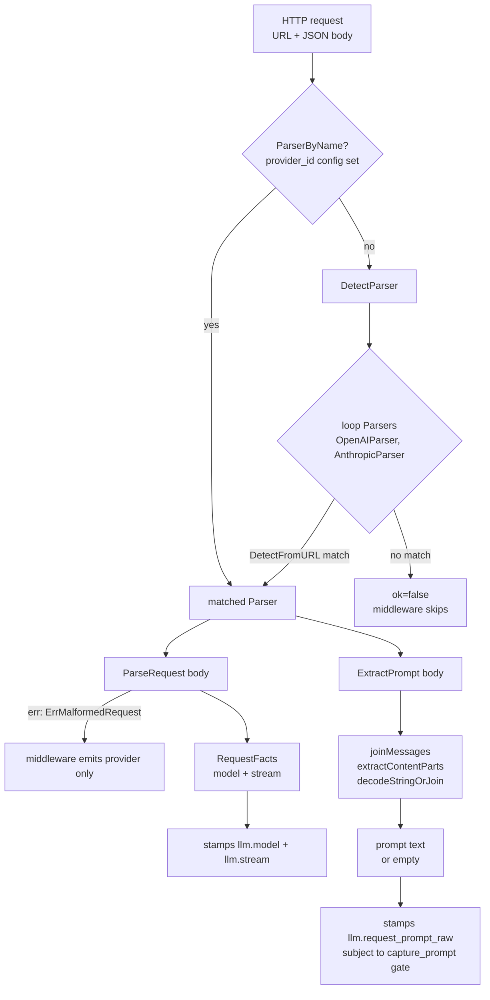
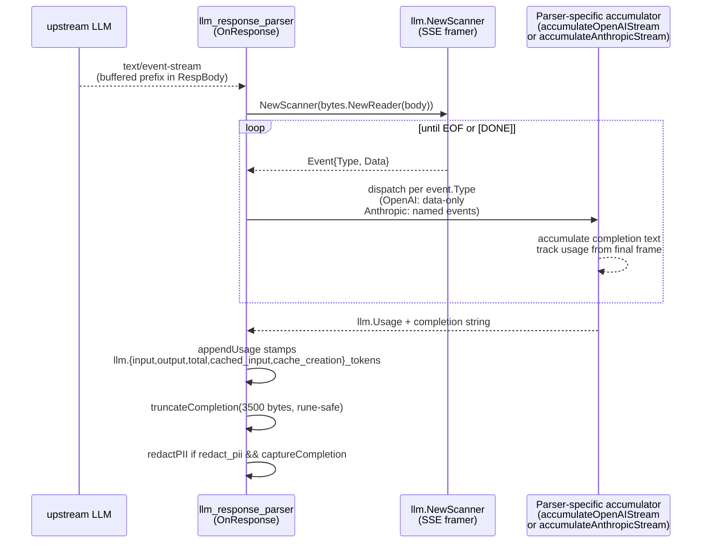

# proxy/llm-parsers — SDK adapters + pricing + SSE

The runtime-agnostic LLM library: the OpenAI Responses API (`/v1/responses`)
and the older Chat Completions API (`/v1/chat/completions`), the Anthropic
Messages API (`/v1/messages`), the SSE wire format (`event:` / `data:` lines,
`\n\n` framing, CRLF tolerance), and per-provider token accounting (OpenAI's
cached-prompt **subset** vs Anthropic's cache_read **additive** model). The
pricing table's per-provider cost formula is the highest-leverage place a
small bug would silently mis-bill operators.

Sibling module: [31-proxy-middleware-builtin.md](./31-proxy-middleware-builtin.md)
— the 8 middlewares that consume this package's parsers + pricing table.

---

## Module boundary

`proxy/internal/llm` is the runtime-agnostic LLM library shared by every
middleware that needs to understand provider-specific shapes. Zero
proxy-framework dependencies:

- `parser.go` — `Parser` interface, `Provider` enum, public factories
  (`Parsers`, `DetectParser`, `ParserByName`).
- `openai.go` / `anthropic.go` / `bedrock.go` — per-provider `Parser` impls.
- `sse.go` — SSE scanner (`Scanner`, `Event`, `NewScanner`).
- `errors.go` — sentinels callers branch on with `errors.Is`.
- `pricing/` — immutable pricing table + the per-surface cost formula. The
  rates themselves come from management inside `cost_meter`'s middleware
  config; this package holds no price list and reads no files.
- `fixtures/` — captured request/response/stream bodies the tests replay.

The package carries zero proxy-framework dependencies so the same parsers can
be reused later by a WASM adapter
([parser.go:1–6](../../../proxy/internal/llm/parser.go)).

## Files

| File | LOC | Notes |
|---|---:|---|
| `parser.go` | 104 | Interface + factories + `Provider{Unknown,OpenAI,Anthropic}` enum |
| `openai.go` | 347 | Chat Completions + Completions + Responses API; cached_tokens subset |
| `openai_test.go` | 222 | 11 tests; fixture replay + cached/Responses-API matrix |
| `anthropic.go` | 172 | Messages + legacy `/v1/complete`; cache_read + cache_creation additive |
| `anthropic_test.go` | 154 | 7 tests including streaming-extraction-skipped contract |
| `bedrock.go` | 190 | AWS Bedrock InvokeModel (snake_case) + Converse (camelCase) response shapes; model lives in URL path |
| `bedrock_test.go` | — | InvokeModel + Converse usage shapes; AWS event-stream content-type → `ErrStreamingUnsupported` on buffered `ParseResponse` |
| `sse.go` | 117 | `bufio`-backed scanner; CRLF normalised; trailing-event handling |
| `sse_test.go` | 175 | 12 tests; fixture replay + multiline + size limits |
| `parser_test.go` | 53 | `Parsers()`, `DetectParser`, provider enum values |
| `errors.go` | 31 | 6 sentinels: `Err{Unknown,Unsupported}Provider/Model`, `Err{NotLLM,Malformed}Response`, `ErrStreamingUnsupported`, `ErrMalformedRequest` |
| `pricing/pricing.go` | 234 | `Table`, `Entry`, `EntryJSON`, `Costs`; `NewTable`/`NewEntries` validation + `EntryCosts` formula. No I/O, no reload, no embedded rates |
| `pricing/pricing_test.go` | 177 | 10 tests — provider-shape formulas, cached clamp, rate fallback, nil-safety, rate validation |
| `fixtures/*` | 21–59 | OAI chat/responses/stream + Anthro messages/stream |

## Request body → parser dispatch


```mermaid
flowchart TD
    A[HTTP request<br/>URL + JSON body] --> B{ParserByName?<br/>provider_id config set}
    B -- yes --> P[matched Parser]
    B -- no --> C[DetectParser]
    C --> D{loop Parsers<br/>OpenAIParser, AnthropicParser}
    D -- DetectFromURL match --> P
    D -- no match --> X[ok=false<br/>middleware skips]
    P --> E[ParseRequest body]
    E -->|err: ErrMalformedRequest| Y[middleware emits provider only]
    E --> F[RequestFacts<br/>model + stream]
    P --> G[ExtractPrompt body]
    G --> H[joinMessages<br/>extractContentParts<br/>decodeStringOrJoin]
    H --> I[prompt text<br/>or empty]
    F --> J[stamps llm.model + llm.stream]
    I --> K[stamps llm.request_prompt_raw<br/>subject to capture_prompt gate]
```

OpenAI's URL hints
([openai.go:27–33](../../../proxy/internal/llm/openai.go)) include
both `/v1/chat/completions` and the bare `/chat/completions` — the latter
covers Cloudflare AI Gateway, which rewrites the canonical version segment.
Anthropic's hints are `/v1/messages` and `/v1/complete`
([anthropic.go:14–17](../../../proxy/internal/llm/anthropic.go)).
Both implementations use case-insensitive substring matching so a proxy prefix
strip / rewrite doesn't defeat detection.

`ParserByName` ([parser.go:93–103](../../../proxy/internal/llm/parser.go))
is the **agent-network bypass**: the synthesiser knows which parser to use
because it built the synth service from the catalog, so it stamps
`provider_id` on the parser config and the middleware skips URL sniffing
entirely. This is what makes the same parser set work whether the request
flows to OpenAI direct, to LiteLLM, to Portkey, or to any gateway with a
non-canonical URL shape.

**Path-routed providers (Vertex AI, Bedrock) bypass both `ParserByName` and
`DetectParser`.** The model and the parser surface live in the URL path, so the
request middleware extracts them directly (`parseVertexPath` /
`parseBedrockPath`) before the parser-selection step. For Vertex the publisher
segment picks the parser (`anthropic` → Anthropic parser; `google`/Gemini →
none, request denied as unmeterable). For Bedrock the dedicated `BedrockParser`
handles the response. Full treatment in
[50-path-routed-providers.md](./50-path-routed-providers.md).

## Streaming response → SSE chunker → response parser → completion + token count


```mermaid
sequenceDiagram
    participant U as upstream LLM
    participant LR as llm_response_parser<br/>(OnResponse)
    participant S as llm.NewScanner<br/>(SSE framer)
    participant P as Parser-specific accumulator<br/>(accumulateOpenAIStream<br/>or accumulateAnthropicStream)

    U-->>LR: text/event-stream<br/>(buffered prefix in RespBody)
    LR->>S: NewScanner(bytes.NewReader(body))
    loop until EOF or [DONE]
        S-->>LR: Event{Type, Data}
        LR->>P: dispatch per event.Type<br/>(OpenAI: data-only<br/>Anthropic: named events)
        P-->>P: accumulate completion text<br/>track usage from final frame
    end
    P-->>LR: llm.Usage + completion string
    LR->>LR: appendUsage stamps<br/>llm.{input,output,total,cached_input,cache_creation}_tokens
    LR->>LR: truncateCompletion(3500 bytes, rune-safe)
    LR->>LR: redactPII if redact_pii && captureCompletion
```

`Scanner.Next`
([sse.go:44–87](../../../proxy/internal/llm/sse.go)) returns one
event per `\n\n` boundary; multiple `data:` lines join with `\n`; comment lines
(starting with `:`) are skipped per the SSE spec; a trailing event without a
closing blank line is still returned before `io.EOF` so a server that closes
the connection cleanly doesn't lose the last frame
([sse.go:55–58](../../../proxy/internal/llm/sse.go)). CRLF is
normalised in `trimEOL` so fixtures captured from live servers replay
unchanged.

## Per-provider

### OpenAI

[openai.go:54–67](../../../proxy/internal/llm/openai.go) defines
`openAIRequest` with three prompt fields: `messages` (Chat Completions),
`prompt` (legacy), `input` (Responses API). The decoder uses
`json.RawMessage` so each shape is parsed lazily.

`ParseResponse`
([openai.go:117–146](../../../proxy/internal/llm/openai.go))
accepts both naming conventions: Chat Completions returns
`prompt_tokens`/`completion_tokens`, Responses API returns
`input_tokens`/`output_tokens`. `pickInt64` prefers Responses-API names and
falls back — same parser handles both endpoints without per-route config.
`openAICachedTokens` mirrors the fallback for
`input_tokens_details.cached_tokens` vs `prompt_tokens_details.cached_tokens`.

**Key invariant:** `CachedInputTokens` for OpenAI is a SUBSET of
`InputTokens`. The cost meter clamps to guard against malformed upstream
responses where `cached > total`.

### Anthropic

[anthropic.go:37–49](../../../proxy/internal/llm/anthropic.go)
defines `anthropicRequest` covering Messages API (`system` + `messages[]`)
and legacy `/v1/complete` (`prompt` string). `ExtractPrompt` emits
`system: <text>` first when present, then per-message `role: content`.

`ParseResponse`
([anthropic.go:82–104](../../../proxy/internal/llm/anthropic.go))
fills three independent token buckets: `InputTokens`, `CacheReadInputTokens`,
`CacheCreationInputTokens`. Latter two are **additive** (not subset).
`TotalTokens` sums all four so downstream dashboards render one "tokens"
number without double-counting.

`ExtractCompletion` walks `content[]` `{type, text}` parts and concatenates
non-empty text with newlines, falling back to legacy `completion`.

### Bedrock

[bedrock.go](../../../proxy/internal/llm/bedrock.go) implements the
`Parser` interface for the AWS Bedrock runtime. Bedrock is **path-routed**: the
model lives in the URL (`/model/{id}/{action}`), so the request middleware
extracts it (see [50-path-routed-providers.md](./50-path-routed-providers.md))
and `ParseRequest` is a deliberate no-op. The parser's real work is on the
response leg, covering both Bedrock body shapes:

- **InvokeModel** — vendor-native. Anthropic-on-Bedrock returns snake_case usage
  (`input_tokens`, `output_tokens`, `cache_read_input_tokens`,
  `cache_creation_input_tokens`) with the same additive cache buckets as
  first-party Anthropic.
- **Converse** — unified camelCase (`inputTokens`, `outputTokens`,
  `totalTokens`). `firstNonZero` folds the two naming conventions into one
  `Usage`; when Converse omits `totalTokens` the parser sums the buckets.

`ProviderName()` returns `"bedrock"` — its own pricing surface in the table
management ships, keyed by the **normalised** model id (region prefix + version
suffix stripped by the request parser; management normalises its keys the same
way at synth time so the two compare equal). `ParseResponse` returns
`ErrStreamingUnsupported` for an
AWS binary event-stream content-type (`application/vnd.amazon.eventstream`,
`isAWSEventStream`) so the caller routes to the streaming accumulator instead.

### SSE framing

`Scanner` is `bufio`-backed, 64 KiB read buffer, 1 MiB max line so a
malicious upstream can't blow process memory
([sse.go:33–38, 97–100](../../../proxy/internal/llm/sse.go)).
`splitField` strips one space after the `:` per the SSE spec. Documented
`not safe for concurrent use`; every consumer creates a fresh scanner per
response body. Streaming accumulators live in the middleware package
([llm_response_parser/streaming.go](../../../proxy/internal/middleware/builtin/llm_response_parser/streaming.go))
but use `llm.NewScanner` so the framing contract stays here.

### Pricing table

**Management is the sole pricing authority.** The proxy carries no embedded
price list and reads no pricing file: the whole table arrives inside
`cost_meter`'s `ConfigJSON` on the ordinary mapping push, and a price change
is just another push — the chain rebuild constructs a fresh `Table`, so there
is nothing to reload
([pricing.go:1–7](../../../proxy/internal/llm/pricing/pricing.go)). The
management side of the contract (catalog defaults, the operator's stored
per-provider prices, and `AgentNetwork.PricingDefaultsFile`) is covered in the
management-side module guide; `cost_meter`'s wire shape is in
[31-proxy-middleware-builtin.md](./31-proxy-middleware-builtin.md).

`EntryJSON`
([pricing.go:36–45](../../../proxy/internal/llm/pricing/pricing.go)) is the
management→proxy contract — five USD-per-1k rates under `input_per_1k`,
`output_per_1k`, `cached_input_per_1k`, `cache_read_per_1k`,
`cache_creation_per_1k`. Management's `pricing.Entry` marshals the identical
names, and `EntryJSON`/`Entry` are field-identical so `NewEntries` converts by
direct struct conversion rather than field-by-field copying (a new rate can't
be silently dropped in transit).

`EntryCosts`
([pricing.go:183–234](../../../proxy/internal/llm/pricing/pricing.go))
is the cost formula — most security-relevant math in this module. The
**surface** (the `llm.provider` value the request parser stamped) selects the
formula, never the tier the entry came from: a per-provider-record override on
an Anthropic route still bills its cache buckets additively.

| Provider | Formula |
|---|---|
| `openai` | `(inTokens − clamped) × InputPer1K + clamped × CachedInputPer1K + outTokens × OutputPer1K` where `clamped = min(cachedInput, inTokens)` |
| `anthropic`, `bedrock` | `inTokens × InputPer1K + cachedInput × CacheReadPer1K + cacheCreation × CacheCreationPer1K + outTokens × OutputPer1K` |
| default | `inTokens × InputPer1K + outTokens × OutputPer1K` |

`bedrock` shares the Anthropic additive-cache formula
([pricing.go:214–229](../../../proxy/internal/llm/pricing/pricing.go)):
Anthropic-on-Bedrock reports the same additive cache buckets, while non-Anthropic
Bedrock models (Nova, Llama) simply report zero in those buckets so cost reduces
to `input + output`.

Each per-bucket rate falls back to `InputPer1K` when zero — operators opt in
to discounts by setting the field.

`Costs`
([pricing.go:143–163](../../../proxy/internal/llm/pricing/pricing.go)) is the
per-request split. The four per-bucket fields are the base; `TotalUSD` and
`CacheUSD` are **derived** in `newCosts` so the aggregates can never drift from
the breakdown. `InputUSD` is always the non-cached input bucket on both
provider shapes, so input and cached-input never double-count.

## Public contracts

**`Parser` interface**
([parser.go:50–66](../../../proxy/internal/llm/parser.go)):

```go
type Parser interface {
    Provider() Provider
    ProviderName() string
    DetectFromURL(path string) bool
    ParseRequest(body []byte) (RequestFacts, error)
    ParseResponse(status int, contentType string, body []byte) (Usage, error)
    ExtractPrompt(body []byte) string
    ExtractCompletion(status int, contentType string, body []byte) string
}
```

Adding a provider means implementing this interface and appending to the
slice returned by `Parsers()` ([parser.go:78–84](../../../proxy/internal/llm/parser.go)).
Order matters: `DetectFromURL` ties resolve by registration order.
`Parsers()` today returns `{OpenAIParser, AnthropicParser, BedrockParser}`.

**`Provider` enum**
([parser.go:8–18](../../../proxy/internal/llm/parser.go)):
`ProviderUnknown = 0`, `ProviderOpenAI = 1`, `ProviderAnthropic = 2`,
`ProviderBedrock = 3`. Numeric values are persisted in nothing today but treat
them as wire-stable — new providers must take fresh numbers.

**`Pricing` construction + lookup**
([pricing.go:60–130](../../../proxy/internal/llm/pricing/pricing.go)):

```go
func NewEntries(raw map[string]map[string]EntryJSON) (map[string]map[string]Entry, error)
func NewTable(raw map[string]map[string]EntryJSON) (*Table, error)

func (t *Table) Lookup(provider, model string) (Entry, bool)
func (t *Table) Cost(provider, model string, inTokens, outTokens, cachedInput, cacheCreation int64) (float64, bool)
func (t *Table) Costs(provider, model string, inTokens, outTokens, cachedInput, cacheCreation int64) (Costs, bool)
func EntryCosts(entry Entry, surface string, inTokens, outTokens, cachedInput, cacheCreation int64) Costs
```

`NewTable` is the surface-keyed defaults table; `NewEntries` returns the raw
two-level map `cost_meter` uses for the per-provider-record tier (it looks up an
`Entry` directly and calls `EntryCosts`, so it needs no `Table` wrapper). Both
reject any non-finite or negative rate, so a corrupt config fails the chain
build rather than mispricing silently. Nil input yields an empty,
never-matching table.

Nil-safe: `t.Cost`/`t.Lookup` on a nil receiver returns `ok=false`
([pricing.go:96–99](../../../proxy/internal/llm/pricing/pricing.go)).
`ok=false` means the surface or model is absent from the table management sent;
the caller emits `cost.skipped=unknown_model`.

## Invariants

1. **The pricing package is pure and platform-independent.** No file I/O, no
   `//go:embed`, no goroutines, no build tags — the rates arrive as config, so
   there is nothing platform-specific left to port. Anything reintroducing a
   read-from-disk path here re-splits pricing authority between management and
   the proxy, which is exactly what this design removed.

2. **SSE scanner handles partial chunks.** A buffered prefix that doesn't end
   in `\n\n` still yields its accumulated event before `io.EOF`
   ([sse.go:55–58](../../../proxy/internal/llm/sse.go)). Tests:
   `TestSSEScanner_OpenAIFixture`, `TestSSEScanner_AnthropicFixture`,
   `TestSSEScanner_MultilineData`, `TestSSEScanner_CRLF`. The streaming
   accumulators ride on this: `accumulateAnthropicStream` and
   `accumulateOpenAIStream` `break` on any scanner error to return partial
   usage rather than aborting
   ([streaming.go:68–73, 144–150](../../../proxy/internal/middleware/builtin/llm_response_parser/streaming.go)).

3. **Management is the only source of rates.** `Table` has no constructor that
   invents prices: the only way in is `NewTable`/`NewEntries` over the wire map
   management sent. A missing or empty `pricing` block therefore means *no
   prices at all* (`cost_meter` records `cost.skipped=unknown_model`, $0) —
   never a stale built-in fallback that would silently bill list price.

4. **Tables are immutable once built.** `Table.entries` is written only in
   `NewEntries` and never mutated afterwards, and `cost_meter`'s `perRecord`
   map is likewise build-time-only
   ([pricing.go:47–52](../../../proxy/internal/llm/pricing/pricing.go)). This
   is what makes the no-reload design safe: a price change arrives as a mapping
   push that builds a new middleware instance over a new table, so concurrent
   readers can't observe a half-updated price list and no atomic swap or lock
   is needed on the hot path.

5. **Rate validation happens at chain-build time, not per request.**
   `NewEntries` rejects negative, NaN, and ±Inf rates field by field
   ([pricing.go:60–83](../../../proxy/internal/llm/pricing/pricing.go)), naming
   the offending surface/model/field in the error. Management enforces the same
   constraints at its API boundary and in its YAML parser, so this is
   defense-in-depth — but it means a corrupt push fails loudly at build instead
   of producing negative costs on live traffic. Test:
   `TestNewTable_ValidatesRates`.

6. **New rates must be added to `Entry`, `EntryJSON`, *and* management's
   `pricing.Entry` together.** `NewEntries` converts by direct struct
   conversion `Entry(e)`
   ([pricing.go:76–78](../../../proxy/internal/llm/pricing/pricing.go)), which
   only compiles while the two structs stay field-identical — so the proxy half
   is compiler-enforced. The management half is not: a rate added there but not
   here unmarshals into nothing and prices that bucket at `InputPer1K`.

## Things to scrutinise

**Correctness.** Verify the OpenAI cached-prompt clamp at
[pricing.go:203–206](../../../proxy/internal/llm/pricing/pricing.go)
short-circuits before subtraction. Negative token counts are clamped to zero up
front ([pricing.go:186–197](../../../proxy/internal/llm/pricing/pricing.go)) so
no formula can yield a negative cost. `Anthropic.TotalTokens` sums all four
buckets (in + out + cache_read + cache_creation) — downstream dashboards
need to know this differs from `input + output`.
`OpenAIParser.ExtractPrompt` falls through `messages → input → prompt`; a
request sending all three reports only `messages` (uncommon but worth
noting).

**Security.** `Scanner.maxLine = 1 MiB`; a 2 MiB single-line `data:` event
errors from `Scanner.Next` and both accumulators stop with partial usage.
Pricing is no longer file-backed, so the loader's path-traversal / symlink /
oversize surface is gone entirely — the config channel (an authenticated
mapping push from management) is now the only way rates enter the proxy, and
`NewEntries` is the validation boundary on it. A new rate added to management's
`pricing.Entry` but not to `EntryJSON` here is the remaining silent-mispricing
path (see invariant 6).

**Concurrency.** Nothing in this package is shared mutable state: tables are
built once and never written again, so `cost_meter`'s hot path is lock-free by
construction rather than by atomic swap. Per-call `Scanner` instances mean no
shared state across concurrent response-parser calls.

**Perf.** `Table.Cost` is two map lookups + multiplications, O(1); the
per-provider-record tier adds at most one more lookup. `Scanner.Next` is one
`ReadString('\n')` per line. No background goroutines and no per-request
allocation of pricing state.

**Observability.** A config carrying no `pricing` block logs one warning at
chain-build time (`cost_meter` factory) and then records
`cost.skipped=unknown_model` per request, so an old-management deployment is
visible in both logs and the access log rather than quietly reporting $0.
Parser errors return sentinels — middleware uses `errors.Is` to map to the
right `cost.skipped` reason.

## Test coverage

| File | Tests | Coverage highlights |
|---|---:|---|
| `parser_test.go` | 3 | `Parsers()` shape lock, `DetectParser` URL matrix, provider enum stability |
| `openai_test.go` | 11 | Chat Completions + Responses API + legacy `prompt`; cached-tokens subset for both naming conventions; fixture replays |
| `anthropic_test.go` | 7 | Messages + legacy `/v1/complete`; streaming REJECTED on `ParseResponse` (must use scanner); fixture replays |
| `sse_test.go` | 12 | Fixture replay both providers; multiline `data:`; CRLF; comment skip; trailing-event-without-blank-line; oversize rejection |
| `pricing/pricing_test.go` | 10 | Provider-shape switch (surface selects the formula); cached-rate + cache-read/creation fallback to `InputPer1K`; cached-clamp; negative-token clamp; nil-receiver safety; rate validation (negative / NaN / Inf rejected); nil + empty table |

**Fixtures** ([proxy/internal/llm/fixtures/](../../../proxy/internal/llm/fixtures/)):
`openai_chat_completion.json` (chat.completions with usage),
`openai_responses.json` (Responses API shape),
`openai_stream.txt` (3 deltas + usage + `[DONE]`),
`anthropic_messages.json` (Messages API non-streaming),
`anthropic_stream.txt` (full 7-event sequence: message_start →
content_block_{start,delta×2,stop} → message_delta (usage) → message_stop).
No pricing fixture: the table is config-delivered, so pricing tests construct
it in-process from a wire-shape map.

## Cross-references

- Sibling: [31-proxy-middleware-builtin.md](./31-proxy-middleware-builtin.md)
  — the chain that calls `llm.Parsers()`, `llm.ParserByName`,
  `llm.NewScanner`, `pricing.NewTable` / `pricing.NewEntries`.
- Path-routed providers (Vertex AI + Bedrock), credential syntax, and the
  Bedrock AWS event-stream accumulator:
  [50-path-routed-providers.md](./50-path-routed-providers.md).
- Direct callers: `llm_request_parser/middleware.go:82–94`,
  `llm_response_parser/middleware.go:113–123`,
  `llm_response_parser/streaming.go:65, 142`, `cost_meter/factory.go:49–57`.
- Related elsewhere: the agent-network synthesiser stamping `provider_id`
  is covered in the management-side module guide; proxy server boot +
  `FactoryContext` construction is covered in the proxy-framework guide.
