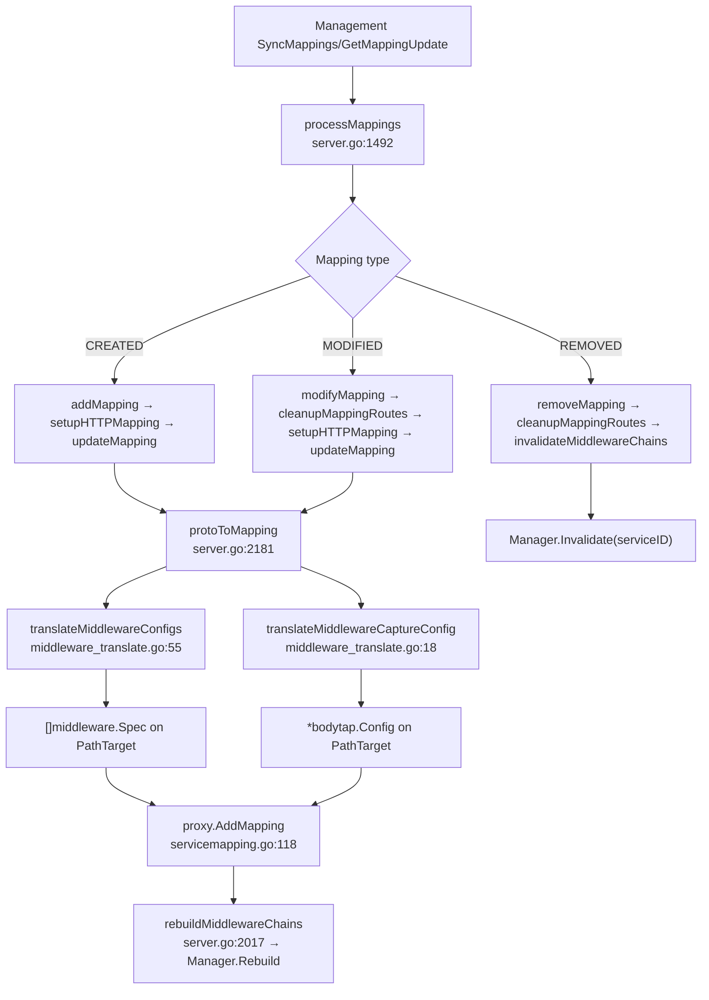
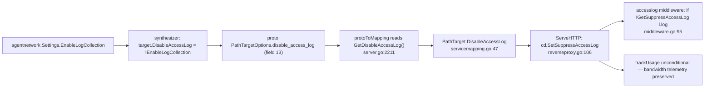

# proxy/runtime — translate + serve + log

> **Reviewer profile:** Proxy maintainer; familiar with the existing `proxy/internal/proxy/reverseproxy.go` request lifecycle, `proxy/internal/accesslog` emission, `proto.ProxyMapping` ingestion via `SyncMappings`/`GetMappingUpdate`, and the `proxy/internal/middleware` framework introduced in modules 30/31/32.
> **Time to review:** 75 minutes
> **Risk level:** High — every config push from management is translated here, and the chain runs on every HTTP request to a synth target
> **Backward-compat impact:** Additive at the wire (`PathTargetOptions.middlewares`, `agent_network`, `disable_access_log`, capture caps) and on the proxy `Server` struct (`MiddlewareDataDir`, `MiddlewareCaptureBudgetBytes`). Non-agent-network targets stay on the no-middleware fast path.

## Module boundary

Turns the synth-service wire format from `ProxyService.SyncMappings`/`GetMappingUpdate` into in-process middleware chains and runs them on top of the existing `httputil.ReverseProxy`. Four concerns: (a) **translate** — `proto.MiddlewareConfig` → validated `middleware.Spec` (proxy/middleware_translate.go) + self-register the eight built-ins (proxy/middleware_register.go); (b) **boot + rebuild** — construct the `middleware.Manager`, share the OTel meter, install the live-service check, rebuild per-path chains on every `addMapping`/`modifyMapping` (proxy/server.go); (c) **serve** — resolve chain at request time, capture bodies under a global budget, invoke `RunRequest`/`RunResponse`/`RunTerminal`, render deny responses, apply `UpstreamRewrite` (proxy/internal/proxy/reverseproxy.go); (d) **log + tag** — emit access-log entries with the new `agent_network` flag, gate emission on `EnableLogCollection` via `DisableAccessLog` (proxy/internal/accesslog).

**Inert for non-agent-network targets**: nil or empty chain → existing fast path (reverseproxy.go:127-139); `SuppressAccessLog` defaults false so the access-log middleware emits unchanged.

## Commits in scope

| SHA | Subject | LOC delta (this module) |
| --- | ------- | --- |
| 3ed29d855 | AN-4b: middleware plumbing in the proxy request path | +711 / −9 |
| e64ea4b02 | AN-5: built-in middlewares + registry registration | +16 |
| 0f9f56a58 | AN-5b: activate the middleware system in the proxy server | +136 / −1 |
| 9a1547143 | AN-6: access-log `agent_network` flag end-to-end | +3 |
| 9ebe219fd | test: lock the auth→middleware group-propagation wiring | +136 |
| 468875cb4 | Wire `EnableLogCollection` to suppress access-log | +222 / −5 |
| b438a7194 | Carry identity onto respInput (PII redaction commit; this module: respInput fix only) | +12 / −4 |
| 2a0d4991b | Self-contained full-chain integration test | +314 |

Total in scope: ~1545 added / 14 deleted across 14 files.

## Files changed

| Path | LOC | Role |
| ---- | --- | ---- |
| proxy/middleware_translate.go | +165 | proto→Spec translation; slot/failmode/timeout mapping; caps |
| proxy/middleware_translate_test.go | +246 | translator unit tests |
| proxy/middleware_register.go | +16 | blank-imports the eight builtins for `init()` registration |
| proxy/server.go | +129 | `initMiddlewareManager`, `rebuildMiddlewareChains`, `isLiveService`, `buildMiddlewareBindings`, new Server fields, `protoToMapping` stamps AgentNetwork/DisableAccessLog/CaptureConfig/Middlewares |
| proxy/internal/proxy/reverseproxy.go | +289 / −9 | `WithMiddlewareManager`, chain dispatch, body capture, `applyUpstreamRewrite`/`Headers`, `buildRequestInput`, response-leg respInput identity fields |
| proxy/internal/proxy/reverseproxy_test.go | +44 | `TestBuildRequestInput_PropagatesIdentityAndGroups` |
| proxy/internal/proxy/context.go | +43 | `agentNetwork`, `suppressAccessLog`, `userGroupNames` on `CapturedData` |
| proxy/internal/proxy/servicemapping.go | +16 | new `PathTarget` fields |
| proxy/internal/proxy/agent_network_chain_realstack_test.go | +314 | end-to-end self-contained chain test |
| proxy/internal/accesslog/logger.go | +2 | `logEntry.AgentNetwork` → `proto.AccessLog` |
| proxy/internal/accesslog/middleware.go | +9 / −1 | reads `GetAgentNetwork()`; gates `l.log` on `!GetSuppressAccessLog()` |
| proxy/internal/accesslog/middleware_test.go | +185 | suppress/default/preserves-usage assertions |
| proxy/internal/auth/middleware_test.go | +92 | tunnel-peer group propagation contract |
| proxy/internal/metrics/metrics.go | +9 | `Meter()` getter for the middleware manager |

## Architecture & flow

### Synth-service ingestion → translate → register → serve



### Per-request lifecycle through the chain + accesslog

```mermaid
sequenceDiagram
    autonumber
    participant C as Client
    participant M as accesslog.Middleware
    participant A as auth.Middleware (Protect)
    participant RP as ReverseProxy.ServeHTTP
    participant CH as middleware.Chain
    participant U as Upstream
    C->>M: HTTP request
    M->>M: NewCapturedData(requestID), WithCapturedData(ctx)
    M->>A: next.ServeHTTP
    A->>A: Private → ValidateTunnelPeer → stamp UserID/Email/Groups/GroupNames/AuthMethod
    A->>RP: next.ServeHTTP
    RP->>RP: findTargetForRequest → targetResult
    RP->>RP: stamp ServiceID/AccountID/AgentNetwork/SuppressAccessLog on CapturedData
    RP->>RP: resolveChain via Manager.ChainFor
    alt chain == nil or Empty
        RP->>U: httputil.ReverseProxy.ServeHTTP (fast path)
    else chain non-empty
        RP->>RP: bodytap.CaptureRequest (global budget)
        RP->>CH: RunRequest
        CH-->>RP: denyOutput? requestMeta + upstreamRewrite
        alt deny
            RP->>C: RenderDenyResponse
        else allow
            RP->>RP: capturingWriter + applyUpstreamRewrite/Headers
            RP->>U: httputil.ReverseProxy.ServeHTTP(respWriter)
            U-->>RP: response
            RP->>CH: RunResponse (respInput carries UserGroups, b438a7194)
            RP->>CH: RunTerminal (merged request+response metadata)
        end
    end
    RP-->>M: handler returns
    M->>M: build logEntry incl. AgentNetwork
    alt SuppressAccessLog == true
        M->>M: skip l.log; still trackUsage
    else default
        M->>M: l.log → goroutine SendAccessLog
    end
```

### EnableLogCollection suppression path



**Ingestion** lands as a `ProxyMapping` batch on `handleSyncMappingsStream`/`handleMappingStream`. `processMappings` dispatches to `addMapping`/`modifyMapping`/`removeMapping`; HTTP goes `setupHTTPMapping → updateMapping → protoToMapping`. `protoToMapping` (server.go:2181) is the single translation surface that materialises `[]middleware.Spec`, `*bodytap.Config`, `AgentNetwork`, `DisableAccessLog` onto each `PathTarget`; `updateMapping` finishes with `s.proxy.AddMapping(m)` (atomic swap under `mappingsMux`) and `s.rebuildMiddlewareChains(svcID, m)`.

At **request time** the access-log middleware stamps `CapturedData`; the auth chain runs (Private services lift `peer_group_ids` from `ValidateTunnelPeer` — auth/middleware_test.go:322). `ReverseProxy.ServeHTTP` resolves the chain; nil or empty → original `httputil.ReverseProxy`, no body capture. When a chain matches, body is captured under the global budget, `RunRequest` produces an `UpstreamRewrite` (`llm_router` selects a provider, rewrites scheme/host/path, injects `Authorization`), and `RunResponse`+`RunTerminal` run after the upstream returns. The terminal slot sees the merged metadata bag — that's how `llm_limit_record` ships the consumption sample. The **access-log** addition: `logEntry.AgentNetwork` from `GetAgentNetwork()` onto `proto.AccessLog.AgentNetwork`; the gate at middleware.go:95 honors `EnableLogCollection`, skipping `l.log` but keeping `trackUsage` so bandwidth telemetry survives.

## Public contracts touched

- `proxy.Server.MiddlewareDataDir` (string) — base dir for file-backed middleware config (server.go:238-241).
- `proxy.Server.MiddlewareCaptureBudgetBytes` (int64) — process-wide capture cap; defaults to 256 MiB (server.go:248-250).
- `proxy/internal/proxy.WithMiddlewareManager(*middleware.Manager) Option` — new option on `NewReverseProxy`; nil keeps the fast path (reverseproxy.go:48-56).
- `proxy/internal/proxy.PathTarget` adds `Middlewares`, `CaptureConfig`, `AgentNetwork`, `DisableAccessLog` (servicemapping.go:27-51), all zero-default.
- `proxy/internal/proxy.CapturedData` adds `agentNetwork`, `suppressAccessLog`, `userGroupNames` behind `sync.RWMutex`; slices deep-copied (context.go:47-66, 183-258).
- `accesslog.logEntry.AgentNetwork` + `proto.AccessLog.AgentNetwork` (logger.go:131, 268).
- `metrics.Metrics.Meter()` exposes the OTel meter for the middleware manager (metrics.go:53-58).

## Invariants

- **Synth-service updates are live (no proxy restart).** Every `MODIFIED` flows through `modifyMapping → cleanupMappingRoutes` (invalidates chains) `→ setupHTTPMapping → updateMapping → rebuildMiddlewareChains`. **Note 263dabd73 (ProxyMapping.Private preservation):** the bug it fixed lives in `management/internals/shared/grpc/proxy.go:shallowCloneMapping`, not this module, but it surfaces here — without the fix, every `MODIFIED` synth service arrived `private=false`, auth skipped `ValidateTunnelPeer`, `CapturedData.UserGroups` stayed empty, `llm_router` denied with `llm_policy.no_authorised_provider`, and only a management restart worked around it. Review this module assuming `mapping.GetPrivate()` is correct on every batch — that assumption is what the cited fix established.
- **`EnableLogCollection=false` suppresses access-log writes but middleware still runs.** Gate is one `if !cd.GetSuppressAccessLog()` immediately around `l.log(entry)` (middleware.go:95); `trackUsage` runs below the gate. Locked by `TestMiddleware_SuppressAccessLog_PreservesUsageTracking` (middleware_test.go:139).
- **`agent_network` flag on access-log entries is set when the chain processed the request.** Source `target.AgentNetwork`, stamped at reverseproxy.go:105, read at accesslog/middleware.go:86.
- **auth → builtin group propagation (9ebe219fd locked this).** `Protect` writes `UserGroups`/`UserGroupNames`; `buildRequestInput` (reverseproxy.go:333) copies them into `middleware.Input`. After b438a7194 the response-leg `respInput` (reverseproxy.go:196-223) also carries `UserEmail`/`UserGroups`/`UserGroupNames` — `llm_limit_record` needs `UserGroups` to ship `group_ids` so management's group-targeted budget rules match (comment at reverseproxy.go:211-215).
- **Empty chains stay on the fast path.** `ServeHTTP` skips body capture and the run sequence when `chain == nil || chain.Empty()` (reverseproxy.go:127).
- **Self-registration is the only way a builtin reaches the registry.** `middleware_register.go` blank-imports each builtin; `init()` adds the factory to `mwbuiltin.DefaultRegistry()`. Missing it → translator drops the entry with a warn (translate.go:97).

## Things to scrutinize

### Correctness
- **Translate edge cases** — drops on nil cfg, empty ID, unknown ID, UNSPECIFIED slot; each logs one warn; volume bounded by `MaxMiddlewaresPerChain`.
- **Re-translate without dropping in-flight requests** — `Manager.Rebuild` is the only call from `rebuildMiddlewareChains`. Reverse proxy reads `ChainFor` once per request (reverseproxy.go:327) and runs the captured `*Chain` for the whole request. Verify in module 30 that `Rebuild` swaps atomically.
- **ProxyMapping.Private preservation** — fixed in 263dabd73 (management). Proxy-side regression catches: `TestProtect_PrivateService_TunnelPeerGroupsPropagate` + the integration test.
- **Body-capture cleanup** — `defer releaseBudget()` (reverseproxy.go:145) and `defer capturingWriter.Release()` (reverseproxy.go:180) must run on every return; confirm no future `return` lands between acquisition and defer.
- **`applyUpstreamRewrite` clones the URL** — `cloned := *orig` value-copies `*url.URL`; safe because overwritten fields are strings, not slices/maps (reverseproxy.go:285-292).

### Security
- **Translate validates every config** — registry membership rejects unknown IDs; UNSPECIFIED slot drops; ID-less drops; raw config copied (not aliased) at translate.go:109.
- **`AuthHeader`/`StripHeaders` only reachable via `UpstreamRewrite`** — regular mutation surface goes through the framework denylist (`Authorization`/`Cookie` blocked); only the router middleware can replace `Authorization` (reverseproxy.go:296-304). Confirm in module 30 nothing outside the proxy-trusted path populates `UpstreamRewrite.AuthHeader`.
- **`stampNetBirdIdentity` strips client-sent values first** (reverseproxy.go:742-743) — anti-spoof for `X-NetBird-User`/`X-NetBird-Groups`; control chars filtered; comma-bearing labels dropped (reverseproxy_test.go:1217/:1243/:1193).
- **Auth → group propagation** — `auth/middleware_test.go:322` and `:366` cover the contract. If auth ever stops calling `ValidateTunnelPeer` for Private services, every agent-network request silently denies.

### Concurrency
- **Chain replacement under in-flight requests** — `findTargetForRequest` takes `mappingsMux.RLock`; `AddMapping` writes. `resolveChain` calls `ChainFor` once; even if `Rebuild` swaps mid-request, in-flight requests keep running on the captured pointer.
- **`CapturedData` mutation across slots** — accessors take `sync.RWMutex`; slices deep-copied on both Set and Get. Verify no caller mutates the returned slice expecting it to land back.
- **`Manager.Invalidate` race** — `removeMapping` invalidates after `cleanupMappingRoutes`; mapping read happens before chain resolution, so requests before invalidate run captured chains; later ones fail `findTargetForRequest`.
- **`Logger.log` goroutine** — `logSem` caps at `maxLogWorkers = 4096`; overflow → `dropped.Add(1)` + debug log. Middleware test uses a buffered channel and 150ms negative-assertion window — review whether 150ms holds on slow CI.

### Backward compatibility
- **Non-agent-network services unaffected** — `protoToMapping` reads new fields only when `opts != nil`; defaults leave `Middlewares`/`CaptureConfig` nil → chain resolves nil → fast path. Existing `reverseproxy_test.go` (non-chain) still passes.
- **`disable_access_log` is proto field 13, default false** — every existing target unset; gate is no-op. Locked by `TestMiddleware_SuppressAccessLog_DefaultEmitsLog` (middleware_test.go:104).
- **`Server` additions optional** — 256 MiB default when `MiddlewareCaptureBudgetBytes ≤ 0` (server.go:1997-2000).

### Performance
- **Translate cost per push** — O(n) with per-entry registry lookup and `config_json` copy; negligible vs. the upstream gRPC unmarshal.
- **Empty-chain hot path** — one `ChainFor` map lookup + one `chain.Empty()` check; no allocation delta vs. pre-PR.
- **Body capture buffer churn** — `bodytap.CaptureRequest` allocates `MaxRequestBytes` per chain-hitting request; `releaseBudget` ties allocation to the 256 MiB proxy-wide budget. Confirm in module 30 the budget is a hard cap.

### Observability
- **Metrics** — `Metrics.Meter()` shared with `middleware.NewMetrics` (server.go:1990-1993) so middleware instruments land in the same prometheus exporter. No new metrics defined here.
- **Access-log accuracy** — every entry carries `AgentNetwork`; terminal-slot metadata merged into `CapturedData.Metadata` (reverseproxy.go:238-241).
- **Deny logs at `Infof`** (reverseproxy.go:170) — review whether `Info` is too noisy at high deny rates; consider Debug or rate-limit.

## Test coverage

| Test file | Locks down |
| --------- | ---------- |
| proxy/middleware_translate_test.go | Empty/nil → nil; field preservation; unknown ID skip; nil registry permissive; timeout clamping; fail-mode + slot incl. UNSPECIFIED-drop; empty-ID drop; truncation above + at `MaxMiddlewaresPerChain` |
| proxy/internal/proxy/reverseproxy_test.go | Rewrite host/headers/cookies/query; trusted proxy; path forwarding; classifyProxyError; X-NetBird-User/Groups anti-spoof + CSV-join + control-char/comma rejection + fallback-to-ID; `TestBuildRequestInput_PropagatesIdentityAndGroups` (UserGroups/Email/GroupNames/AgentNetwork reach `middleware.Input`) |
| proxy/internal/proxy/agent_network_chain_realstack_test.go | **THE end-to-end integration test added by 2a0d4991b.** Drives a real agent-network request through `ReverseProxy.ServeHTTP` with the chain the synthesizer produces, against an in-process management gRPC (bufconn) backed by a real sqlite store + real `agentnetwork.Manager`, plus an `httptest` upstream. No tilt/docker/real LLM. Guarantees: (1) response-leg `respInput` carries `UserGroups` so `llm_limit_record` ships non-empty `group_ids` and the admin-group consumption row increments — the exact regression class b438a7194 fixed; (2) `RedactPii=true` redacts both prompt and completion on captured metadata; (3) full chain runs against a real management stack. **Line 189-211 inlines the proto→Spec mapping** instead of calling the proxy's private `translateMiddlewareConfig` — keep that inline mirror in sync with `proxy/middleware_translate.go` or the test silently diverges from production. |
| proxy/internal/accesslog/middleware_test.go | `SuppressAccessLog=true` skips `SendAccessLog` (150ms negative wait); default emits one send (2s positive); usage tracking runs under suppression |
| proxy/internal/auth/middleware_test.go | `TestProtect_PrivateService_TunnelPeerGroupsPropagate` proves `peer_group_ids` reach `CapturedData.UserGroups`; `TestProtect_PrivateService_TunnelPeerDenied` proves rejected peers 403 without reaching the handler |

The integration test replaces the bash 50/51 e2e legs in ~5s, no docker/tilt — exercising the real synthesizer, `Manager.Rebuild`, `ServeHTTP` dispatch, and `llm_limit_record` writing a real consumption row through the real `agentnetwork.Manager` over real gRPC.

## Known limitations / explicit non-goals

- **Translator does not validate `RawConfig` JSON** — factory's job at `New([]byte)`. Confirm in module 30 that a per-binding factory failure doesn't poison the rest of the chain.
- **No throttle on management push rate** — every `MODIFIED` triggers `Manager.Rebuild`. Mitigation upstream.
- **Streaming responses (SSE)** — body capture is streaming-aware, but response-leg middleware runs only after the response completes; long SSE streams delay `llm_limit_record` until close.
- **OIDC-only path doesn't carry tunnel-peer groups** — agent-network synth services rely on the Private tunnel-peer path; JWT groups claim is the only carrier for non-Private OIDC.
- **`agent_network` flag on L4 entries** not added; HTTP-only in this PR.
- **`mw.capture.bypass_reason` metadata key** documented at reverseproxy.go:151,184; namespace this in module 30/31 to avoid collisions.

## Cross-references
- Upstream: [shared/api](10-shared-api.md), [proxy/middleware-framework](30-proxy-middleware-framework.md), [proxy/middleware-builtin](31-proxy-middleware-builtin.md), [proxy/llm-parsers](32-proxy-llm-parsers.md)
- End-to-end flow: [../01-end-to-end-flows.md](../01-end-to-end-flows.md)
- Top-level: [../00-overview.md](../00-overview.md)
