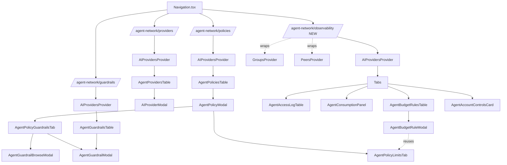
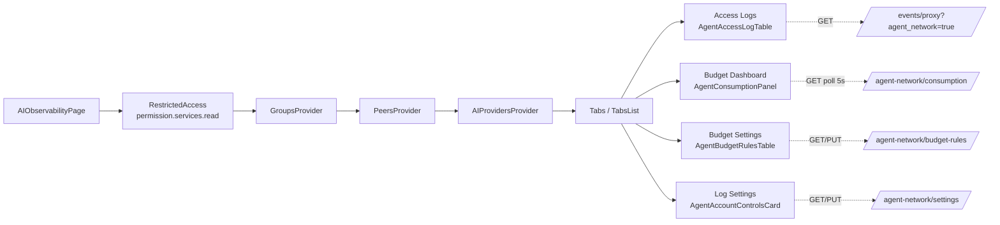
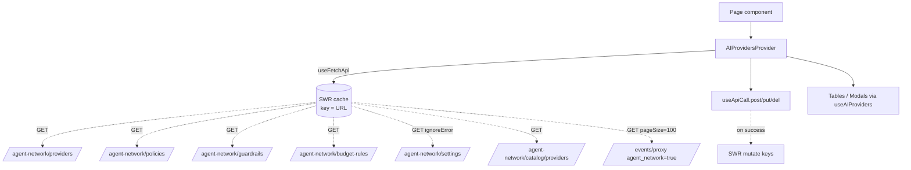

# dashboard — UI for agent-networks

> **Reviewer profile:** Dashboard maintainer; familiar with the Next.js app-router under `src/app/(dashboard)`, the existing Tabs / Modal / DataTable components, the Providers / Permissions / Groups context pattern, and the React-Flow control-center graph. Light familiarity with the agent-network REST routes is enough.
> **Time to review:** 90 minutes (broad surface; many small components, a few large ones)
> **Risk level:** Medium. New surface is isolated under `src/modules/agent-network/` and `src/app/(dashboard)/agent-network/`, but the PR also reshapes the sidebar, splits `/peers`, renames `reverse-proxy/clusters` → `self-hosted-proxies`, and overlays the Control Center graph. Regressions here would be cross-cutting.
> **Backward-compat impact:** Additive on the API side. Breaking on URL/navigation: `/peers` redirects to `/peers/devices` (src/app/(dashboard)/peers/page.tsx:7-15), `/reverse-proxy/clusters` was renamed to `/reverse-proxy/self-hosted-proxies`, the sidebar lost Access Control / Networks / Reverse Proxy / DNS / standalone Guardrails / Consumption / Activity (Navigation.tsx:165-171 — routes still resolve via URL), and the standalone `/agent-network/{access-log,consumption,global-controls}` routes are gone in favor of `/agent-network/observability` (3fbe44e).

## Module boundary

The dashboard is the only place an operator interacts with agent-networks: provider catalog, configured providers, policies, guardrails, account-level budget rules, account settings (collection / redaction toggles), per-request access log, and consumption rollups all render, paginate, and edit here. Data flows in via SWR (`useFetchApi`) keyed by REST URL. One big context provider (`src/modules/agent-network/AIProvidersProvider.tsx`) aggregates five resources (providers, policies, guardrails, budget rules, settings) plus the proxy access-log stream filtered to `agent_network=true`, and exposes `add* / update* / toggle* / delete*` mutators that call through `useApiCall` and re-`mutate()` SWR. Pages mount the provider once at the top and compose presentational tables and modals beneath. The control-center page additionally fetches `/agent-network/{providers,policies}` directly (control-center/page.tsx:123-130) to overlay graph nodes.

## Commits in scope (newest first)

| SHA | Subject | LOC delta |
| --- | ------- | --------- |
| 3fbe44e | [agent-network] Merge Global Controls + Access Log into AI Observability | +160 / −207 |
| 1988e92 | Global Controls page (account toggles + budget rules) | +1453 / −1 |
| 95b4daa | control center: open agent-policy modal on node click; hide rows-per-page | +51 / −3 |
| b0c4f3e | peers table: compact toolbar + user filter | (peers + UserFilterSelector) |
| a61581b | control center + peers: agent-network overlay + width trims | (control-center + peers) |
| e159d6b / d2ea1fb | control center: drop All Networks dropdown; hide Networks tab | (FlowSelector + page) |
| 7bf59b8 | rename peer sub-views to User Devices and Agents & Servers | (peers + PeersListView) |
| a65a956 | repackage dashboard nav for agent-network focus | (Navigation.tsx) |
| e7bdc5e / 672195a | reverse-proxy: Private toggle + cluster target; drop body-capture knobs | (reverse-proxy) |
| f0b5214 / 4be7d3c / 2875ade / eb54136 / 924537f / c446eec / e042ca3 | Provider modal: OpenRouter, Vercel, Cloudflare, Bifrost (×2), Portkey, LiteLLM Mappings | (AIProviderModal) |
| 1f24392 | window_hours → window_seconds; minute picker on Limits | (PolicyLimitsTab) |
| 2157fec / 59564fd | Consumption page: charts + filters; basic counter view | (ConsumptionPanel + Table) |
| 1af6754 | resolve providers by config-row ID in access log | (AccessLogTable) |
| 6b91b7a | account-level endpoint surface on providers page | (providers/page.tsx) |
| 51221e8 / 6a26ccb | wire access log to /events/proxy?agent_network=true; resolve group IDs | (provider context) |
| b50a689 | Drop Budgets & Alerts; rebuild Access Log in Proxy Events style | (rewrite) |
| 2b7f746 / 5e10a2b / 4d3ac8d / 77a7070 | Wire guardrails / policies / providers / catalog to backend | (provider context) |
| 4cf718f | Add Agent Network dashboard preview | +6036 LOC (initial scaffold) |

Total branch delta vs `main`: ~ +10.9k / −890 LOC across 82 files.

## Surface added

### New pages

| Route | Purpose | Backing module(s) |
| ----- | ------- | ----------------- |
| `/agent-network` | Redirect to `/agent-network/providers` | page.tsx:7-15 |
| `/agent-network/providers` | List + connect providers; header surfaces per-account base URL | providers/page.tsx + AgentProvidersTable + AIProviderModal |
| `/agent-network/policies` | Group → Provider authorization with per-policy Limits + Guardrail attach | policies/page.tsx + AgentPoliciesTable + AgentPolicyModal |
| `/agent-network/guardrails` | Reusable guardrail sets (model allowlist + prompt capture) | guardrails/page.tsx + AgentGuardrailsTable + AgentGuardrailModal |
| `/agent-network/observability` | NEW (3fbe44e). Tabs: Access Logs / Budget Dashboard / Budget Settings / Log Settings | observability/page.tsx |
| `/peers/devices`, `/peers/agents` | Split of `/peers`, shared via `PeersListView` keyed by `kind` | peers/{devices,agents}/page.tsx |
| `/reverse-proxy/self-hosted-proxies` | Renamed from `clusters` | self-hosted-proxies/page.tsx |

Deleted in 3fbe44e: `/agent-network/access-log`, `/agent-network/consumption`, `/agent-network/global-controls`.

### New modules under src/modules/agent-network

| File | Role |
| ---- | ---- |
| AIProvidersProvider.tsx (~1158 LOC) | Aggregates every agent-network resource via SWR; normalises snake↔camel; exposes mutators; holds wizard-open state |
| AIProviderModal.tsx (~1268 LOC) | Connect / edit provider wizard with per-vendor copy (Bifrost, Portkey, LiteLLM, Cloudflare, Vercel, OpenRouter, custom) |
| AIProviderLogo + useProviderCatalog | Catalog-driven brand swatch + SWR hook over `/agent-network/catalog/providers` |
| AgentPoliciesTable + AgentPolicyModal + AgentPolicyGuardrailsTab + AgentPolicyLimitsTab | Policies; modal has 3 tabs (Rule, Limits, Guardrails) |
| AgentGuardrailsTable + AgentGuardrailModal + AgentGuardrailBrowseModal + AgentGuardrailChecksCell | Guardrails CRUD + attach-from-policy |
| AgentBudgetRulesTable + AgentBudgetRuleModal | Account-level budget rules; modal reuses AgentPolicyLimitsTab verbatim |
| AgentAccountControlsCard | Three account-wide toggles (Log Collection / Prompt Collection / Redact PII) |
| AgentAccessLogTable + AgentAccessLogExpandedRow | Access log on `/events/proxy?agent_network=true` |
| AgentConsumptionPanel + AgentConsumptionTable | Token + cost panel: charts + counter table |
| table/AgentProvidersTable + AgentProviderActionCell | Providers table + per-row actions |
| data/mockData.ts | Domain types and a few residual `MOCK_*` constants (see scrutinize) |

### Touched non-agent-network areas

- **control-center**: agent-network overlay (provider + agent-policy nodes); removed All Networks dropdown (a61581b, e159d6b); hid Networks tab in FlowSelector (FlowSelector.tsx:9-14 — enum value kept so `?tab=networks` still type-checks); wrapped `ControlCenterView` in `AIProvidersProvider` (page.tsx:73-83); `agentPolicyNode` clicks routed to a separate state slot (page.tsx:1871-1874). New node renderers: nodes/ProviderNode.tsx, nodes/AgentPolicyNode.tsx (registered at utils/nodes.ts:21-22).
- **peers**: Split into Devices and Agents sub-routes; shared via `PeersListView` keyed by `kind` (PeersListView.tsx:24-95). New compact-toolbar `UserFilterSelector` (users/UserFilterSelector.tsx).
- **reverse-proxy**: Folder rename `clusters/` → `self-hosted-proxies/`; deleted `ClustersFeaturesCell.tsx`, `ClusterTypeIndicator.tsx`; new ReverseProxyClusterTargetSelector for cluster target type (e7bdc5e); Private toggle on target modal; body-capture knobs removed (672195a); new ReverseProxyEventExpandedRow.
- **events**: `ReverseProxyEventsUserCell` rewritten with user + peer fallback (ReverseProxyEventsUserCell.tsx:14-21), shared with the access-log table.
- **navigation**: Full repackaging in Navigation.tsx — Agent Network items flattened (no collapsible parent), distinct icons per item; Access Control, Networks, Reverse Proxy, DNS, standalone Guardrails, Consumption, Activity removed (still URL-reachable, per lines 165-171).

## Architecture & flow

### Page → Provider → Table/Modal hierarchy

### AI Observability tab page (today's commit)

### Data fetch path

Every list view reaches management through SWR over `/api/agent-network/*`. The provider context maps snake-case payloads to camelCase domain types (`fromAPI`, `policyFromAPI`, `guardrailFromAPI`, `budgetRuleFromAPI`, `settingsFromAPI`, `accessLogFromAPI` — AIProvidersProvider.tsx:138-562) and back via matching `*ToRequest` adaptors. The access log piggy-backs on `/events/proxy` with `agent_network=true&page_size=100` (line 707-709) and decodes LLM-specific fields from per-event `metadata`. Group IDs on events are resolved to current names through the surrounding GroupsProvider catalog (lines 515-521, 717-731) — no extra round trip. Mutators run `*ToRequest`, await `useApiCall.post/put/del`, call SWR `mutate()`, then `notify`. Errors caught and surfaced via `notify` — no exceptions escape into render. The Connect Provider modal's open state lives in the provider itself (`isWizardOpen` at lines 732-735) so the providers-page empty-state CTA and the table's + button share one modal. Control-center re-fetches `/agent-network/{providers,policies}` directly on top of `AIProvidersProvider` — SWR de-dupes but the code path is harder to reason about.

## Public contracts consumed

- `GET/POST /api/agent-network/providers`, `PUT/DELETE /:id`
- `GET/POST /api/agent-network/policies`, `PUT/DELETE /:id`
- `GET/POST /api/agent-network/guardrails`, `PUT/DELETE /:id`
- `GET/POST /api/agent-network/budget-rules`, `PUT/DELETE /:id`
- `GET/PUT /api/agent-network/settings` (ignoreError-tolerant; 404 = not yet bootstrapped — auto-bootstrap on first provider create via `bootstrap_cluster` field — AIProvidersProvider.tsx:737-760)
- `GET /api/agent-network/catalog/providers` (read-only declarative; backend owns vendor list, IDs, brand colors, models, extra_headers, identity_injection — useProviderCatalog.ts:6-95)
- `GET /api/agent-network/consumption` (polled every 5s on Budget Dashboard — ConsumptionPanel.tsx:53,65-71)
- `GET /api/events/proxy?agent_network=true&page_size=100` (shared with Proxy Events)
- `permission?.services?.read` gates every agent-network route via RestrictedAccess.

`AIProviderId` is a closed union in dashboard types (data/mockData.ts:8-21) but the converter tolerates anything the backend ships — unknown ids fall through to `"custom"` (AIProvidersProvider.tsx:497-506). Catalog values are pure read-through: anything declared in `extra_headers` renders in the modal automatically, copy keyed by header name (`EXTRA_HEADER_UI` in AIProviderModal.tsx:61-89), labeled-fallback for unknown ones.

## Invariants

- Provider context wrap order on user-attribution pages: `GroupsProvider > PeersProvider > AIProvidersProvider` (observability/page.tsx:87-89). Reverse it and access-log group resolution silently drops names.
- Every agent-network route checks `permission?.services?.read` via `RestrictedAccess` (observability/page.tsx:85, providers/page.tsx:184, policies/page.tsx:53, guardrails/page.tsx:55).
- Modal `key={open ? 1 : 0}` pattern is used to force unmount/remount on close so internal `useState` resets between edits (AgentBudgetRuleModal.tsx:60, AgentPolicyModal.tsx:66). Removing this would leak prior-row state into a new-row session.
- `mockData.ts` is the canonical home for ALL agent-network domain types; `MOCK_*` constants must never reach a production code path. One leak remains (below).

## Things to scrutinize

### Correctness

- **Tab-state URL hand-off is one-way.** observability/page.tsx:53-58 reads `?tab=` on mount (despite the file comment at line 28 saying URL hand-off is future) but `setTab` does NOT push back, so reload preserves the chosen tab only if it came in via the link. Inconsistent with control-center (page.tsx:1817-1831).
- **Provider overlay runs only in `applySingleGroupView` / `applyPeerView`** (control-center/page.tsx:557, 1159-1166). User view does NOT show providers — if agent-network is a primary lens, that's a gap.
- **Two useEffects race to invalidate the control-center layout.** page.tsx:1655-1657 drops `layoutInitialized` when `agentPolicies` / `agentProviders` arrive; the main effect (1786-1799) also lists them as deps. Works today but fragile — watch for flash-of-empty-graph.
- **`updateProvider` / `updatePolicy` / `updateBudgetRule` use `??` on `enabled`** (AIProvidersProvider.tsx:784, 859, 1018). Toggle paths are safe; any caller sending `enabled: false` thinking "leave it off" gets `existing.enabled` instead. Audit modal callers.
- **Form validation in modals is minimal.** Window-seconds picker (1f24392) — mockData.ts:209-215 documents "minimum 60 — one minute" but I couldn't find a matching UI guard in PolicyLimitsTab.

### Security

- **No client-side enforcement claims** — every cap, allowlist, and toggle is display + edit; proxy is the source of truth for deny decisions (AccessLogTable.tsx:177-191 renders backend-emitted `denyReason` as-is).
- **Prompt display is gated by what the backend stamps.** When `enable_prompt_collection` is OFF the proxy must not put prompt/completion into event metadata; the dashboard renders whatever it gets verbatim (AccessLogTable lines 532-534, AccessLogExpandedRow.tsx:42-57). No UI filter on top of backend collection switches.
- Account Controls disables `Redact PII` when `Prompt Collection` is off (AgentAccountControlsCard.tsx:122) and clears it on off-transition (line 100), but relies on backend to enforce the same gate at write — confirm PUT handler rejects `redact_pii=true && enable_prompt_collection=false`.
- **Bifrost identity-header overrides**: empty-string vs nil semantics documented in AIProvidersProvider.tsx:772-781 ("omitted = preserve, empty = explicit clear"). Mishandling could leak group attribution to a header the operator thought disabled. Focused read of Bifrost code path in AIProviderModal.tsx recommended.

### Accessibility

- Observability TabsList (observability/page.tsx:96-113) uses the shared Tabs component — should inherit Radix roving-tabindex. All four TabsTriggers carry only icon + text, no `aria-label`; fine because text is visible.
- Modal focus traps are inherited from the shared Modal; agent-network modals don't override them. Quick keyboard pass recommended.
- `EndpointBadge` Copy button (providers/page.tsx:66-76) has an `aria-label`, good.

### Performance

- `AgentConsumptionPanel` polls `/agent-network/consumption` every 5s (ConsumptionPanel.tsx:53,70). Tab switches unmount the panel, so the poll stops — verify in network panel.
- `AgentAccessLogTable` is hard-capped at 100 rows via `page_size=100` (AIProvidersProvider.tsx:707-709). Server-side pagination is future work; high-traffic tenants miss everything past row 100 — known limitation.
- Observability page mounts providers ONCE at page level (observability/page.tsx:87-89); tab switches keep SWR cache hot. Moving the provider mount inside `TabsContent` would re-fetch the access log on every switch.

### Visual consistency

- Observability tab style claims to match peer/page.tsx (3fbe44e commit msg). Outer Tabs `pt-4 pb-0 mb-0`, TabsList `px-8` (observability/page.tsx:94-96) — confirm chrome height matches so the page doesn't visually jump.
- Sidebar: `Boxes` for Providers, `AccessControlIcon` for Policies, `TelescopeIcon` for AI Observability (Navigation.tsx:113,120,133). Reusing `AccessControlIcon` makes Policies look identical to the (now hidden) Access Control item — if Access Control ever comes back, they collide.
- `AgentNetworkIcon` is used in breadcrumbs on every agent-network page but NOT in the sidebar (per-page icons instead). Deliberate departure — record so it doesn't get reverted.

## Test coverage

- **Cypress**: One file (`cypress/e2e/test.cy.ts`) covering only the install-page copy-to-clipboard flow. NOTHING covers agent-network UI.
- **Component / unit tests**: `src/utils/version.test.ts` is the only `.test.*` file in the repo. The agent-network modules ship without component tests.
- Data-cy hooks exist on key controls: `save-account-controls` (AgentAccountControlsCard.tsx:71), `enable-log-collection`, `enable-prompt-collection`, `redact-pii`, plus existing `data-cy={policy.name}` / `data-cy={provider.name}` on ActiveInactiveRow. Sufficient hooks for Cypress flows; none written yet.
- **Tooling gap (not introduced by this PR):** `npm run lint` (`next lint`) is broken in Next 16 — the `lint` subcommand was removed from the Next CLI in 16.x. Same script lives on `main`, but the merge means the dashboard effectively ships without a working lint gate. Worth flagging now; add either a flat-config `eslint .` script or wire ESLint via an explicit `eslint-config-next` invocation.

## Known limitations / explicit non-goals

- **`data/mockData.ts` still contains `MOCK_GROUPS`, `MOCK_PROVIDERS`, `MOCK_PEERS`.** Only `MOCK_GROUPS` is referenced from production — AgentPoliciesTable.tsx:45,76 uses it as a name-lookup fallback when a policy references a group ID the real GroupsProvider doesn't know about. `MOCK_PROVIDERS` / `MOCK_PEERS` are unreferenced; safe to delete. The file is `/* eslint-disable */` so dead-code warnings don't flag them.
- **Tab-state URL hand-off on observability page is one-way** (read-only).
- **Access log hard-capped at 100 rows**; no server-side pagination.
- **No optimistic updates.** All mutations are round-trip; failures rollback via SWR revalidation.
- **`FlowView.NETWORKS` retained but hidden** from FlowSelector (FlowSelector.tsx:9-14). Old `?tab=networks` links still route to the hidden view because `applyNetworksView` still runs.
- **Redirects are not query-preserving** — `router.replace("/peers/devices")` (peers/page.tsx:13) strips any incoming filter params.
- **Control-center cross-fetches** `/agent-network/{providers,policies}` directly on top of `AIProvidersProvider`. Could be collapsed.
- **Sidebar permanently hides Access Control, Networks, Reverse Proxy, standalone Guardrails, DNS, Activity, Consumption.** Routes still resolve via URL (Navigation.tsx:165-171); intentional per a65a956.

## Cross-references

- Upstream API contracts: [shared/api](10-shared-api.md)
- Backend persistence: [management/store](20-management-store.md)
- Backend handler wiring: [management/handlers](22-management-handlers-wiring.md) (planned)
- End-to-end flow narrative: [../01-end-to-end-flows.md](../01-end-to-end-flows.md)
- Top-level overview: [../00-overview.md](../00-overview.md)
