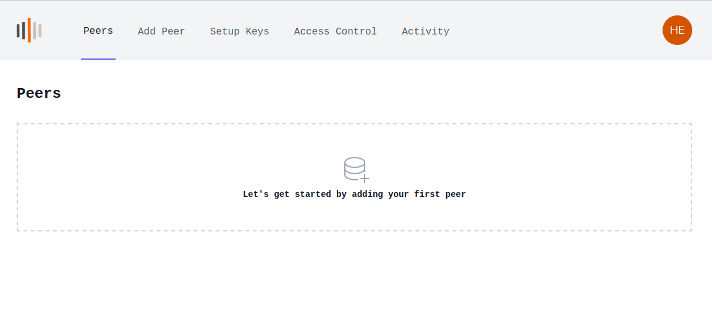
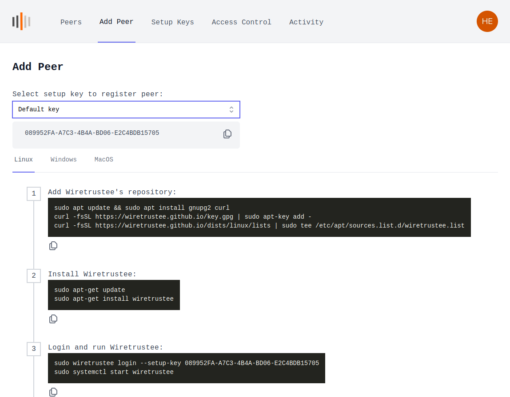
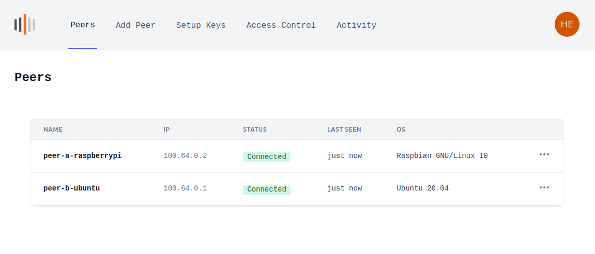

### Quickstart guide (Cloud Managed version)
Step-by-step video guide on YouTube:

[](https://youtu.be/j0EPaK5Rapw "Wiretrustee - secure private network in less than 5 minutes")

This guide describes how to create secure VPN and connect 2 machines peer-to-peer.

One machine is a Raspberry Pi Compute Module 4 hosted at home (Peer A), and the other one is a regular Ubuntu server running in the Data Center (Peer B).
Both machines are running Linux (Raspbian and Ubuntu respectively), but you could also use Mac or Windows operating systems.

1. Sign-up at [https://beta.wiretrustee.com/](https://beta.wiretrustee.com/peers)

    You can use your email and password to sign-up or any available social login option (e.g., GitHub account)
    
    

2. After a successful login you will be redirected to the ```Peers``` screen which is empty because you don't have any peers yet.
   
    Click ```Add peer``` to add a new machine.
    
    
    
3.  Choose a setup key which will be used to associate your new machine with your account (in our case it is ```Default key```).

    Choose your machine operating system (in our case it is ```Linux```) and proceed with the installation steps on the machine.

        

4. Repeat #3 for the 2nd machine.
5. Return to ```Peers``` and you should notice 2 new machines with status ```Connected```
   
    

6. To test the connection you could try pinging devices:
   
    On Peer A:
    ```ping 100.64.0.2```
    
    On Peer B:
    ```ping 100.64.0.1```
7. Done! You now have a secure peer-to-peer VPN configured.